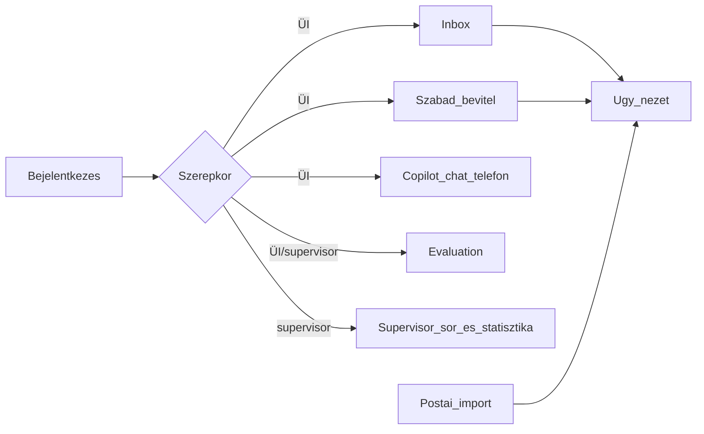
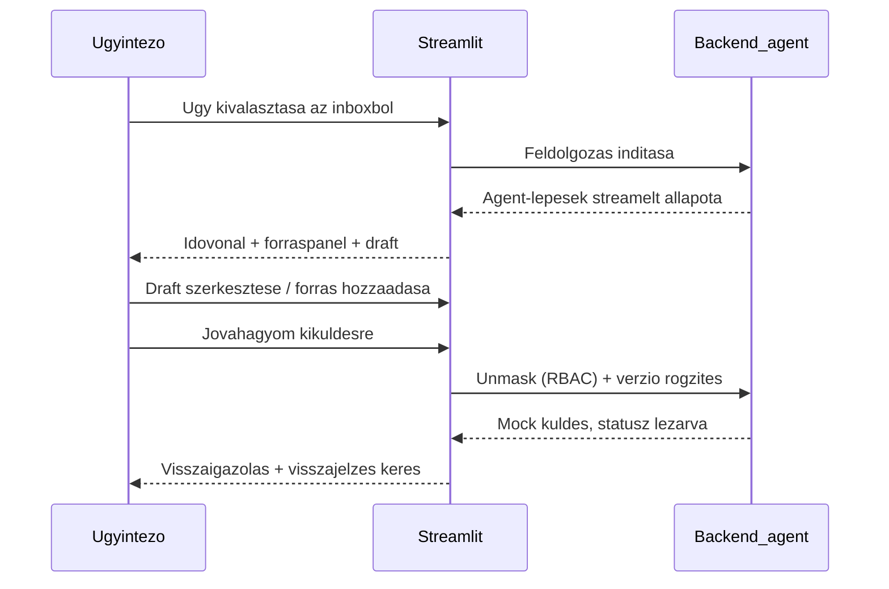

# ÁSZF Q&A Agent — Frontend-spec (wireframe szint)

> Kapcsolódó: [ASZF_QnA_Agent_megvalositasi_terv.md](ASZF_QnA_Agent_megvalositasi_terv.md) (Fázis 4), [ASZF_QnA_Agent_uzleti_spec.md](ASZF_QnA_Agent_uzleti_spec.md).
> UI-keret: **Streamlit** (magyar nyelvű). Ez a dokumentum a nézeteket, komponenseket, interakciókat és állapotokat rögzíti wireframe szinten.

## Elrendezési alapelvek
- **Streamlit-kompatibilis** elrendezés: bal **sidebar** (globális vezérlők) + fő terület; oszlopokhoz `st.columns`, csoportosításhoz `st.tabs` és `st.expander`.
- **Háromhasábos ügy-nézet**: bal = kontextus (források, előzmények, ügyféltörzs), közép = bejövő + draft, jobb = agent-idővonal.
- **Konzisztens színkódolt badge-ek** állapotokhoz (kategória, prioritás, konfidencia, eszkaláció, SLA).
- **Magyar feliratok**, hivatalos, letisztult megjelenés.

## Navigáció



- A nézetváltás a **sidebar menüből** (`st.radio`/`option_menu`) történik; az elérhető menüpontok szerepkör-függők.

## Globális elemek (sidebar)
- **Bejelentkezett felhasználó** + szerepkör (ÜI / supervisor); „Kijelentkezés".
- **Modell-profil kapcsoló**: felhő (Azure OpenAI EU) ↔ on-prem (Ollama) — `PROVIDER`.
- **ÁSZF-verzió/dátum** kijelzés + **„Újraindexelés"** gomb (`/reindex`), megerősítéssel.
- **Kimeneti mód** alapértelmezett kapcsoló: human-in-the-loop (alap) / teljes AI-automata.
- Globális keresőmező (ügy-azonosító / feladó).

## Nézetek

### 1. Bejelentkezés
- Mezők: felhasználónév, jelszó (konfig `users.yaml`). Hibás belépés → hibajelzés.
- Sikeres belépés után a szerepkör meghatározza az elérhető menüt; az **aktuális ügyintéző neve auditba** kerül.

### 2. Inbox (ÜI)
Bejövő üzenetek listája, kiválasztás → ügy nézet.

```text
+--------------------------------------------------------------------------+
| Szűrők: [Kategória ▾] [Prioritás ▾] [Státusz ▾] [Csatorna ▾] [Keresés...] |
+--------------------------------------------------------------------------+
| ● SÜRGŐS    | Számlázás | Új          | email  | "Téves számla..."     2 ó |
|   normál    | Díjemelés | Folyamatban | postai | "Díjemelés kifogás..."1 nap|
| ⚠ ESZKALÁLT | Felmondás | Eszkalálva  | email  | "Szerződés..."        3 nap|
+--------------------------------------------------------------------------+
```
- **Oszlopok**: prioritás-jel, kategória, státusz, csatorna-ikon (email/chat/telefon/postai), tárgy-kivonat, SLA-hátralévő.
- **Rendezés**: prioritás / SLA / beérkezés szerint. **Szűrés**: kategória, prioritás, státusz, csatorna.
- **Badge-ek** soronként: kategória, prioritás (SÜRGŐS piros), eszkaláció (⚠), alacsony konfidencia.
- Üres állapot: „Nincs megjeleníthető üzenet."

### 3. Szabad bevitel (ÜI)
- Nagy szövegmező: **email beillesztése** vagy **szabad szöveges kérdés**; opcionális csatorna-választó.
- „Feldolgozás" gomb → ad-hoc ügy nézet (nem kerül feltétlen az inboxba).
- Használat: gyors teszt / nem inbox-alapú kérdés.

### 4. Ügy nézet (háromhasábos)
A fő munkafelület. Felül **ügyfejléc** badge-ekkel és SLA-számlálóval.

```text
+--------------------------------------------------------------------------+
| Ügy #1234 | Számlázás | ● SÜRGŐS | Konf: 0.82 | ⚠ Eszkaláció | SLA: 12 nap |
| Csatorna: email | Feladó: [NÉV_1] <maszkolt@...> | Státusz: Folyamatban   |
+----------------------+---------------------------+-----------------------+
| BAL: Kontextus       | KÖZÉP: Tartalom           | JOBB: Agent-idővonal  |
|                      |                           |                       |
| [Források]           | Bejövő (kiemelésekkel)    | 1 Nyelv/típus  ✓      |
|  §12.3 ÁSZF  ⤴       |  "...a díj [kiemelt]..."  | 2 Maszkolás    ✓      |
|  idézet + magyarázat |                           | 3 Osztályozás  ✓      |
|                      | --- Draft (szerkeszthető)-| 4 Prioritás    ✓      |
| [Előzmények]         |  Tárgy: ...               | 5 Szabályzat   ✓      |
|  2024-11 panasz ⤴    |  Tisztelt ... !           | 6 Eszkaláció   ⚠      |
|                      |  [sablonblokkok/szabad]   | 7 Sablon       ✓      |
| [Ügyféltörzs-jelölt] |                           | 8 Levél        ✓      |
|  Kovács J. (ID 9981)⤴|  Verzió: v3 ▾             | 9 Ellenőrző    ✓      |
|  Kovács J. (ID 7742)⤴|  [Jóváhagyom kiküldésre]  |  (kattintható lépés)  |
+----------------------+---------------------------+-----------------------+
```

#### Bal hasáb — kontextus
- **Források panel**: a hivatkozott §-ok **szó szerinti szövege** + `dok_tipus` jelölés (ÁSZF / melléklet / „Egyéb felhasználási feltételek"), **ugorható** (⤴) kattintás a teljes szakaszra; **„Közérthető magyarázat" kapcsoló** a jogi szöveg mellett.
- **Előzmények panel**: azonos email címről érkezett korábbi üzenetek (dátum, tárgy, kategória, státusz), kattintással megnyitható; jelzés, ha **ismétlődő panasz**.
- **Ügyféltörzs-jelöltek panel**: a címhez tartozható ügyfelek **név + azonosító** listája, **átlinkeléssel** (⤴, POC-ban mock); jelölőnégyzettel kiválasztható → a kiválasztás **szolgáltatóra szűkítheti** a keresést.

#### Közép hasáb — tartalom
- **Bejövő üzenet** a hivatkozandó szövegrészek **kiemelésével**; **hover** → kapcsolódó forrás/§ infó.
- **Draft-szerkesztő**:
  - **Szabad szövegmező** ÉS **strukturált sablonblokkok** (kapcsolható nézet).
  - **Verziótörténet** (`v1, v2, ...`) legördülő; korábbi verzió visszatölthető/összevethető.
  - Forrás-hivatkozások **hozzáadása/elvétele** a szövegben.
  - **Kimeneti mód** kapcsoló: automata (kötelező disclaimer) / HITL (disclaimer opcionális).
  - **„Jóváhagyom kiküldésre"** → unmask (RBAC), verzió rögzítése, **mock küldés**, státusz „lezárva".
  - **ÜI-visszajelzés**: jó/rossz + „rossz forrás" jelölés.

#### Jobb hasáb — agent-idővonal
- A Fázis 3 node-jai **lépésenként**, állapot-ikonnal (✓ kész / ⚠ figyelmeztetés / ⟳ fut / ✗ hiba).
- Lépésre kattintva **kibontható** a node kimenete (pl. osztályozás-jelöltek, szabályzat-térkép elemei, eszkaláció okai, groundedness nem-megalapozott állításai).
- **Eszkaláció** lépésnél kiemelt jelzés + „Eszkaláció supervisorhoz" gomb (ha még nem eszkalált).

### 5. Csatorna-fülek
`st.tabs`: **Email | Chat-copilot | Telefon-copilot | Postai levél**. Mind az ügy nézetbe vezet, csatorna-specifikus bevitellel.

#### 5/a. Postai levél import
```text
+-----------------------------------------------+
| [PDF feltöltése]  drag & drop / tallózás       |
+-----------------------------------------------+
| OCR-eredmény (szerkeszthető)   | Konf: 0.91    |
|  "Tisztelt Ügyfélszolgálat! ..."               |
|  [alacsony konfidenciájú szó kiemelve]         |
+-----------------------------------------------+
| [Szöveg javítása kész] -> [Feldolgozás]        |
+-----------------------------------------------+
```
- PDF feltöltés → `/ocr` → **szerkeszthető OCR-előnézet** konfidencia-jelzéssel (alacsony konfidenciájú részek kiemelve).
- „Feldolgozás" → a javított szöveg az **email-flow**-ba lép; innen a megszokott ügy nézet.

#### 5/b. Chat / telefon copilot
```text
+----------------------------+-----------------------------+
| ÜI kérdése / beillesztett   | Agent válasz: BESZÉDPONTOK  |
| átirat:                    |  • pont 1  (forrás §..)     |
|  [szövegmező] [Küldés]      |  • pont 2  (forrás §..)     |
+----------------------------+-----------------------------+
```
- Real-time „ÜI kérdez → agent forrással válaszol" panel; kimenet **beszédpontok + forráshivatkozás** (nem szó szerinti script).
- Átirat beilleszthető (feliratozás szimulált).

### 6. Supervisor nézet (supervisor szerepkör)
- **Eszkalált ügyek sora**: a supervisorhoz eszkalált ügyek listája (ok, prioritás, SLA), átvétel/kezelés.
- **Összesített statisztika-dashboard**: ügyintézőnkénti és aggregált mutatók (feldolgozott ügyek, eszkalációs arány, átlagos válaszidő, ÜI-visszajelzés). *Megj.: aggregált nézet, nem egyedi PII.*

### 7. Evaluation nézet (ÜI/supervisor)
- **Futtatás**: „Kiértékelés indítása" (`/eval/run`) a szintetikus, címkézett készleten; opcionális szűrés kategóriára/szolgáltatóra.
- **Aggregált KPI-k**: source citation rate, kritikus hallucináció, coverage, escalation appropriateness, time-to-answer, version mismatch, audit completeness — célértékkel és állapotjelzéssel (zöld/sárga/piros).
- **Kérdés-szintű tábla**: kérdés, groundedness, citation flag, retrieval-support, judge-pontszám (1–5), **opcionális emberi 1–5** beviteli mező.
- **Regresszió**: aktuális futás vs. mentett baseline diff.
- **Export**: riport letöltése.

## Komponens-leltár (újrafelhasználható)
- **Badge** (kategória/prioritás/konfidencia/eszkaláció/SLA/csatorna) — színkódolt.
- **Forrás-kártya** (§, dok_tipus, idézet, „közérthető magyarázat" kapcsoló, ugró link).
- **Előzmény-kártya** (dátum, tárgy, kategória, státusz, link).
- **Ügyféltörzs-kártya** (név, azonosító, link, kiválasztó).
- **Agent-lépés-elem** (név, állapot-ikon, kibontható kimenet).
- **Draft-szerkesztő** (szabad/sablon kapcsoló, verzió-legördülő, mód-kapcsoló, jóváhagyás, visszajelzés).
- **KPI-kártya** (érték, célérték, állapot-szín).

## Badge-legenda
- Prioritás: `● SÜRGŐS` (piros) / `normál` (szürke).
- Eszkaláció: `⚠ ESZKALÁLT` (narancs).
- Konfidencia: küszöb alatt sárga jelzés.
- SLA: `≤ X nap` zöld → közeledő határidő sárga → lejárt piros.
- Csatorna-ikon: email / chat / telefon / postai.

## Fő interakciós folyamat (ügy feldolgozása)



## Állapotok és élfeltételek
- **Betöltés**: agent-lépéseknél `⟳` + spinner; a lépések inkrementálisan jelennek meg.
- **Hiba**: node-hiba `✗` + hibaüzenet; retry lehetőség.
- **Eszkaláció**: eszkalált ügy a középső műveletek helyett „supervisorhoz eszkalálva" állapotot mutat.
- **Üres állapotok**: inbox/előzmény/ügyféltörzs „nincs adat" üzenettel.
- **Hatókörön kívüli**: a draft helyett „nincs elég információ + eszkaláció javasolt" jelzés.

## Hozzáférés-vezérlés a UI-ban (RBAC)
- **Maszkolatlan PII / unmask** csak jogosult szerepkörnek (az „Jóváhagyom kiküldésre" előtti unmask naplózva).
- A **supervisor** statisztika-nézete aggregált (nem egyedi PII).
- Az **ügyféltörzs valós adatai** éles integrációban RBAC + DPA mögött (POC: mock).

## Streamlit-megjegyzések / korlátok
- A háromhasábos elrendezés `st.columns([1,2,1])`-gyel; a panelek `st.expander`-ben.
- Az agent-idővonal inkrementális frissítése `st.status`/`st.empty` + rerun-minta szerint.
- A kiemelés/hover egyszerű HTML/markdown (`st.markdown(..., unsafe_allow_html=True)`); komplex interakcióhoz opcionális egyedi komponens.
- A részletes vizuális dizájn (téma, ikonkészlet) az implementáció során finomítható.
