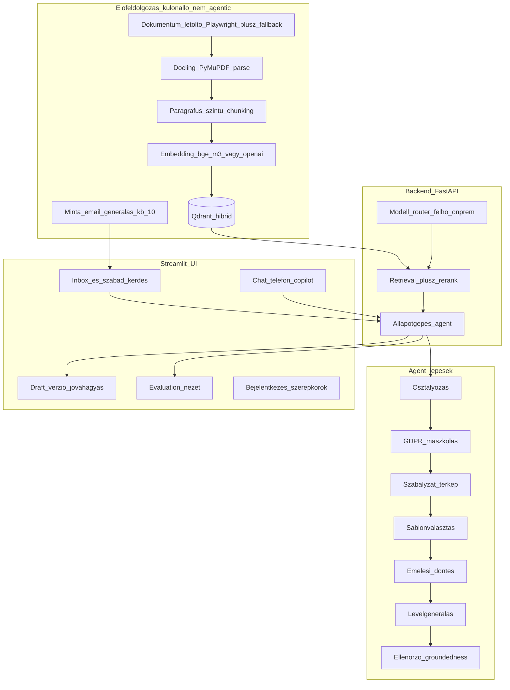

# ÁSZF Q&A Agent — POC megvalósítási terv

> Mentve: 2026-06-06. Forrás üzleti spec: [ASZF_QnA_Agent_uzleti_spec.md](ASZF_QnA_Agent_uzleti_spec.md).
> Ez a terv a tisztázó körök döntéseit konszolidálja: rögzített tech-stack, funkcionális/üzleti döntések, fázisonkénti megvalósítás (modulok, endpointok, agent-node-ok, UI-nézetek, audit, kiértékelés) és compliance/adatbiztonság. A **részletes frontend-spec (wireframe szint)** és a **konkrét al-agent promptkatalógus** külön, későbbi lépés.

---

## Feladatlista (todo)

- [ ] **scaffold** — Projektváz: mappastruktúra, requirements, kapcsolható felhő/on-prem config, README
- [ ] **preprocessing** — Előfeldolgozó CLI: ONE dok-letöltő (Playwright + fallback), Docling/PyMuPDF parse, §-szintű chunking, embedding+index, ~10 minta-email generálás
- [ ] **backend-rag** — FastAPI + LlamaIndex RAG backend: hibrid (dense+sparse) retrieval Qdrant felett + rerank + forráshivatkozás, modell-router, válasz-szintézis
- [ ] **agent-statemachine** — LangGraph állapotgépes agent: osztályozás, Presidio GDPR-maszkolás (visszafordítható), szabályzat-térkép, sablonválasztás, emelési döntés, levélgenerálás, ellenőrző
- [ ] **ui** — Streamlit UI váz: inbox + szabad kérdés, agent-idővonal, forráspanel/kiemelés, draft+verzió+jóváhagyás, csatorna-fülek, badge/SLA, konfig-alapú bejelentkezés (ÜI/supervisor aggregált statisztika nézettel)
- [ ] **audit-governance** — Audit naplózás, disclaimer konfig, GDPR megőrzési korlátok, két kimeneti mód
- [ ] **eval-harness** — Referencia-mentes kiértékelő: groundedness, citation support, relevancy, retrieval-support; opcionális szintetikus kérdésbank; Evaluation UI
- [ ] **compliance-security** — Azure OpenAI EU + no-training, maszkolt egress, titkosított de-id térkép, RBAC + PII-láthatóság, prompt-injection védelem, napló-redakció, Art. 22 safeguards, `docs/dpia.md` (DPIA + adatáramlási térkép)

---

## Rögzített tech-stack és döntések

- **Agent-keretrendszer**: LangGraph (explicit node/állapot, checkpoint, human-in-the-loop megállók).
- **RAG/ingest**: LlamaIndex.
- **Vektor-DB**: Qdrant, **hibrid (dense+sparse) keresés** bekapcsolva (§-számok, szakszavak miatt).
- **Embedding**: `bge-m3` (lokál) / `text-embedding-3-large` (felhő), közös interfész.
- **Reranking**: `bge-reranker-v2-m3` (lokál) / opcionális Cohere.
- **Generálás**: **Azure OpenAI (EU régió)** GPT (felhő, DPA + no-training) ↔ Ollama `Llama 3.3 70B` / `Qwen2.5 72B` (on-prem), kapcsolható router.
- **Perzisztencia**: SQLite (inbox, ügyek, draftok, verziók, audit, userek).
- **Auth**: konfig-alapú felhasználólista jelszóval, szerepkörök: ÜI / supervisor. A **supervisor** emellett **összesített nézetet** lát az ügyintézők statisztikáiról (aggregált dashboard).
- **GDPR**: Microsoft Presidio, **visszafordítható** maszkolás (token↔valós térkép); csak maszkolt szöveg megy (felhős) LLM-be, a valós ügyféladat kiküldés előtt visszakerül az ÜI oldalán.
- **Taxonómia**: hibrid (fix kategória-mag + szabályzati altípusok).
- **Válasz-sablonok**: LLM-generált, **egyszeri emberi jóváhagyással** validált blokk-készlet.
- **SLA**: szabályzatból kinyert határidők, **30 napos fogyasztóvédelmi fallback**, ha nincs explicit talált határidő.
- **UI nyelve**: magyar. **Copilot input**: gépelt szöveg / beillesztett átirat.

## Rögzített funkcionális / üzleti döntések

- **Osztályozás**: nulláról (önálló POC, nincs külső előosztályozó-függés; az előosztályozó később szimulálható).
- **Eszkaláció**: emelt ügy átkerül egy **supervisor-sorba** az appban (valódi átadási folyamat).
- **Konfidencia**: konfigurálható küszöb, alatta **automatikus emelés** (a küszöb hangolható).
- **Nem-panasz email**: az agent felismeri, rövid válaszjavaslatot ad, és „nem panasz" címkével jelöli.
- **Hatókörön kívüli / megválaszolhatatlan kérdés**: elutasítás + emelés, **nincs „biztos" állítás** (hallucináció=0, AI Act elv).
- **Email-mellékletek**: POC-ban figyelmen kívül / csak jelzés (OCR amúgy is szimulált).
- **Ügy-összevonás**: **manuális** összekapcsolás ügy-azonosítóval; a vezető csatorna a jóváhagyott válaszé.
- **Szabályzat-térkép (ÜI nézet)**: releváns §-ok + kötelező behivatkozások + alkalmazandó szabályzatok listája, forráshivatkozással.
- **Kötelező behivatkozás kihagyása**: az agent **figyelmeztet, de nem blokkol** (az ÜI felel).
- **Levél hangneme**: hivatalos, udvarias magyar ügyféllevél-stílus, konfigurálható.
- **Disclaimer**: jogilag óvatos draftot adunk, üzleti/jogi véglegesítéssel.
- **Dokumentum-verziókezelés**: a POC-ban egy aktuális verzió, verzió/dátum metaadattal (elavult-verzió kezelés később).
- **Hatókör**: tájékoztatás **+ javasolt intézkedés**, kockázat-szintezett végrehajtási modellel (lásd lentebb).
- **ÜI-visszajelzés**: strukturált értékelés (jó/rossz, rossz forrás) a válaszokra; betanulást és KPI-t táplál.
- **Válaszlevél**: teljes, formázott email (tárgy, megszólítás, törzs, intézkedés, disclaimer, aláírás).
- **Telefon/chat copilot kimenet**: beszédpontok + forráshivatkozás (nem szó szerinti script).
- **Jogi nyelv**: a § szó szerinti szövege MELLETT közérthető magyar magyarázat.
- **Ügy-státusz workflow**: új → folyamatban → emelve → jóváhagyásra vár → lezárva.
- **Prioritás triázs**: az agent prioritást javasol (sürgős/normál), inbox-rendezés eszerint.
- **SLA**: vizuális figyelmeztetés + automatikus emelés supervisorhoz a határidő lejártakor.
- **Tudás-frissítés**: manuális „újraindexelés" gomb/CLI + verzió/dátum kijelzés.
- **Idegen nyelvű email**: felismerés + jelzés, de magyar feldolgozás/válasz.
- **ÜI szerkeszthet**: a levélszöveget szabadon, a forrás-hivatkozásokat hozzáadhatja/elveheti.
- **Dokumentumtípus a hivatkozásnál**: ÁSZF vs. melléklet vs. „Egyéb felhasználási feltételek" megjelölve.

### Intézkedés-végrehajtás governance (eldőlt)

- **Kockázat-szintezett modell**: alacsony kockázatú intézkedés **automatikus végrehajtható (mock)** a teljes AI-automata módban; közepes/magas kockázatú **mindig emberi jóváhagyást** igényel.
- **Engedélyezett intézkedés-típusok a POC-ban**: (a) önkiszolgáló-link / GYIK / tájékoztatás, (b) visszahívás / technikus időpont ajánlása. **Jóváírás/kompenzáció és szerződésfelmondás NEM engedélyezett intézkedésként** — ezeknél az agent emel/továbbít.
- **Audit**: minden javasolt és (mock) végrehajtott intézkedés naplózva — ki, mikor, mit, mely módban.
- A POC-ban valós CRM/számlázó hiányában a végrehajtás mock.

## Architektúra áttekintés

## Fázis 0 — Repó- és projektváz
- Python projekt (`pyproject.toml` vagy `requirements.txt`), modulstruktúra a komponensekhez:
  - `preprocessing/` — letöltő, parser, chunker, indexelő, minta-email generátor (CLI belépőkkel).
  - `backend/` — FastAPI app, retrieval/rerank szolgáltatás, modell-router, citation-építő.
  - `agent/` — LangGraph gráf, node-ok (osztályozás, maszkolás, szabályzat-térkép, sablon, emelés, levél, ellenőrző), állapot-séma, checkpoint.
  - `security/` — Presidio maszkoló + de-id térkép kezelő, napló-redakció, RBAC-ellenőrzés.
  - `ui/` — Streamlit app, nézetenként külön modul (inbox, ügy, copilot, evaluation, login).
  - `eval/` — referencia-mentes kiértékelő futtató + riport.
  - `data/` — `raw_pdfs/`, `processed/`, `sample_emails/`, SQLite fájl.
  - `config/` — `settings.py`, `doc_sources.yaml`, `policies.yaml`, `templates/`, `users.yaml`, `disclaimer.yaml`.
  - `docs/` — `dpia.md` (DPIA + adatáramlási térkép).
- **`config/settings.py`**: profilváltó (`PROVIDER=cloud|onprem`) embeddinghez, generáláshoz, rerankinghez; Azure OpenAI EU vs. Ollama endpoint; Qdrant-kapcsolat (hibrid keresés ki/be); SQLite-útvonal; konfidencia-küszöb; SLA-alapérték (30 nap); retention-paraméterek.
- `docker-compose.yml` a Qdrant-hoz (és opcionálisan Ollamához); `.env.example` (kulcsok, endpointok); README a futtatáshoz (előfeldolgozás → backend → UI sorrend).

## Fázis 1 — Előfeldolgozás (különálló, nem-agentic CLI)
- **Letöltő** (`preprocessing/download.py`): a 4 aloldal (`#aszf-one`, `#aszf-helyi-kabeles`, `#aszf-ah-media`, `#aszf-invitech`) + „Egyéb felhasználási feltételek" PDF-linkjeinek felderítése. Mivel `one.hu` WAF + JS-render: **Playwright** headless a fő út (renderelés után a `/static/documents/...` linkek begyűjtése); **fallback** a `config/doc_sources.yaml` kézi URL-listából és a `data/raw_pdfs/` mappába kézzel bemásolt PDF-ekből. A letöltött fájlokhoz forrás-URL, aloldal (szolgáltató), letöltési dátum metaadat.
- **Parse + chunk** (`preprocessing/parse.py`): Docling/unstructured (layout-tudatos) + PyMuPDF fallback; **paragrafus/§-szintű** chunking. Chunk-metaadat: `szolgaltato` (ONE/helyi kábeles/AH Média/Invitech), `dok_tipus` (ÁSZF / melléklet / „Egyéb felhasználási feltételek"), `dok_cim`, `paragrafus_szam` (§), `verzio`/`hatalyba_lepes_datum`, `oldalszam`. A `dok_tipus` a forráshivatkozás megjelölését szolgálja.
- **Index** (`preprocessing/index.py`): embedding (`bge-m3` lokál / `text-embedding-3-large` felhő) → Qdrant kollekció **hibrid (dense+sparse)** indexszel; a sparse ág a §-számok és szakszavak pontos találatát segíti. Verzió/dátum a payloadban (tudás-frissítéskori újraindexeléshez).
- **Minta-emailek** (`preprocessing/gen_emails.py`): ~10 magyar, anonim email a fix taxonómia kategóriáira (számlázás, díjemelés, hibabejelentés/szolgáltatáskiesés, szerződésfelmondás/-módosítás, lefedettség, eszköz/készülék, adatvédelem), **plusz legalább 1 nem-panasz** és **1 idegen nyelvű** példa a megfelelő ágak demózásához; mentés `data/sample_emails/`. Valós email megadása (beillesztés/feltöltés) is támogatott a UI-on.

## Fázis 2 — RAG backend (FastAPI + LlamaIndex)
- **Hibrid retrieval** Qdrant felett (dense + sparse) + **rerank** (`bge-reranker-v2-m3` lokál / opcionális Cohere). A találat forráshivatkozással tér vissza: § + szó szerinti szövegrész + dokumentum-metaadat (`szolgaltato`, `dok_tipus`, `verzio/datum`, `oldalszam`).
- **Modell-router** (`backend/router.py`): a `PROVIDER` profil szerint Azure OpenAI (EU) vagy Ollama; válasz-szintézis idézet-kötelezettséggel (minden tartalmi állításhoz forrás), a `dok_tipus` megjelenítésével.
- **Konkrét endpointok (vázlat):**
  - `POST /classify` — kategória + konfidencia + (több jelölt bizonytalanságnál).
  - `POST /mask` és `POST /unmask` — Presidio maszkolás / visszafejtés (RBAC mögött).
  - `POST /retrieve` — hibrid keresés + rerank, forrásokkal.
  - `POST /policy-map` — releváns §-ok + kötelező behivatkozások + alkalmazandó szabályzatok.
  - `POST /draft` — válaszlevél/copilot-javaslat generálás (sablonblokkok + idézetek + disclaimer mód szerint).
  - `POST /verify` — groundedness/citation-ellenőrzés a draftra.
  - `POST /eval/run` — kiértékelő futtatás.
  - `POST /reindex` — tudás-frissítés (újraindexelés, verzió/dátum frissítés).
- **Visszakövethetőség**: minden válasz mellé rögzül a használt modell, promptverzió és ÁSZF-verzió (audit + Evaluation).

## Fázis 3 — Állapotgépes agent (LangGraph)

A gráf node-jai (sorrendben), eszközhívásokkal és a Fázis 2 endpointokra támaszkodva. Minden node kimenete bekerül a LangGraph állapotba és a UI lépés-idővonalába (checkpoint).

1. **Nyelv- és típusfelismerés**: idegen nyelvű email → jelölés, de a feldolgozás/válasz magyarul; **nem-panasz** detektálás → „nem panasz" címke + rövid válaszjavaslat-ág.
2. **GDPR-maszkolás** (Presidio, visszafordítható): a maszkolás a legelső érdemi lépés; a token↔valós térkép a `security/` titkosított tárba kerül; innentől csak maszkolt szöveg megy (felhős) LLM-be.
3. **Osztályozás**: hibrid taxonómia — fix kategória-mag (számlázás, díjemelés, hibabejelentés/szolgáltatáskiesés, szerződésfelmondás/-módosítás, lefedettség, eszköz/készülék, adatvédelem, egyéb) + szabályzati altípusok; **konfidencia** is. Bizonytalanságnál több kategória + forrás.
4. **Prioritás-triázs**: sürgős/normál javaslat (pl. SLA-közeli, jogi/hatósági jel) → inbox-rendezéshez.
5. **Szabályzat-térkép**: releváns §-ok + **kötelező behivatkozások** + alkalmazandó szabályzatok, forrással és `dok_tipus`-szal; a jogi szöveg mellé **közérthető magyarázat**.
6. **Emelési döntés**: `config/policies.yaml` triggerek (egyedi szerződés gyanú, vitatott összeg, ismétlődő panasz, jogi/hatósági/média, **konfidencia < küszöb**, SLA-lejárat) → emelés a supervisor-sorba. **Hatókörön kívüli/megválaszolhatatlan** kérdés → elutasítás + emelés, „biztos" állítás nélkül.
7. **Sablon- és intézkedés-javaslat**: sablonválasztó rangsorol a `config/templates/` LLM-generált, jóváhagyott blokk-készletből (ÜI dönt). Intézkedés-javaslat a kockázat-szintezett modell szerint (engedélyezett: önkiszolgáló/tájékoztatás, visszahívás/technikus; jóváírás/felmondás → emelés).
8. **Levél-/copilot-generálás**: email-ágon teljes formázott levél (tárgy, megszólítás, törzs, intézkedés, disclaimer mód szerint, aláírás); copilot-ágon beszédpontok + forráshivatkozás.
9. **Ellenőrző (groundedness)**: minden tartalmi állítás visszavezethető-e a forrásra; kötelező behivatkozás hiányában **figyelmeztetés** (nem blokkol).
10. **Unmask + jóváhagyás-előkészítés**: a valós ügyféladat a végső szövegbe a kiküldés-előtti jóváhagyásnál kerül vissza (RBAC mögött).

- **SLA**: határidő a szabályzatból kinyerve, **30 napos fallback**, ha nincs explicit talált határidő.
- A részletes al-agent katalógus és a node-promptok véglegesítése **külön spec lépés**.

## Fázis 4 — Streamlit UI (váz; részletes spec később)
- **Belépők / nézetek**:
  - (a) **Ügyintézői inbox**: bejövő emailek listája, kategória-, prioritás- (sürgős/normál) és státusz-jelöléssel; rendezés prioritás/SLA szerint; szűrés. Sorból → ügy nézet.
  - (b) **Szabad bevitel**: beillesztett email vagy szabad szöveges kérdés ad-hoc feldolgozása.
- **Ügy nézet**:
  - **Agent-állapot lépés-idővonal** (a Fázis 3 node-jai, kimenetekkel).
  - **Forráspanel**: a hivatkozott §-ok szó szerinti szövege + `dok_tipus` (ÁSZF / melléklet / „Egyéb felhasználási feltételek") jelölés, ugorható kattintás; a jogi szöveg mellett **közérthető magyarázat** kapcsoló.
  - Az email törzsében **kiemelt** hivatkozandó szövegrészek, **hover**-infóval.
  - **Badge-ek**: kategória, prioritás, **konfidencia**, **emelés** jelzés; **SLA-számláló** (lejáratkor automatikus emelés supervisorhoz).
- **Draft-szerkesztő**: **verziótörténet** (iterációk), **szabad szöveg ÉS strukturált sablonblokkok**; az ÜI a forrás-hivatkozásokat hozzáadhatja/elveheti; **kimeneti mód** választó: (1) teljes AI-automata → kötelező disclaimer, (2) human-in-the-loop alapeset → disclaimer opcionális; „Jóváhagyom kiküldésre" (mock küldés, verzió rögzítése).
- **ÜI-visszajelzés**: jó/rossz + „rossz forrás" jelölés a válaszokra (betanulás/KPI).
- **Csatorna-fülek**: email / chat-copilot / telefon-copilot (copilot = beszédpontok + forrás; átirat beilleszthető).
- **Bejelentkezés + szerepkörök** (konfig `users.yaml`): ÜI / supervisor; aktuális ügyintéző neve auditba. **Supervisor**: emelt ügyek **sora** + **összesített statisztika-nézet** az ügyintézőkről.
- **Tudás-frissítés**: „újraindexelés" gomb (`/reindex`) + aktuális ÁSZF-verzió/dátum kijelzés.
- Külön **Evaluation** nézet (lásd Fázis 6).

## Fázis 5 — Audit és governance
- **Audit-rekord tartalma** (ügyenként/iterációnként): kérdés/bejövő (maszkolt), válasz/draft, idézett források (§ + `dok_tipus`), kategória + konfidencia, **emelés** ténye/oka, **javasolt és (mock) végrehajtott intézkedés** (ki/mikor/mit/mely mód), jóváhagyó ügyintéző + időbélyeg + jóváhagyott verzió, **modell/promptverzió/ÁSZF-verzió**, kimeneti mód (automata/HITL), ÜI-visszajelzés.
- **Ügy-státusz workflow** perzisztálva: új → folyamatban → emelve → jóváhagyásra vár → lezárva.
- **RBAC**: maszkolatlan PII és `unmask` csak jogosult szerepkörnek; minden ilyen hozzáférés naplózva.
- **Napló-redakció**: a logok/tracek csak maszkolt szöveget tárolnak.
- **Disclaimer**: fix, jogilag óvatos szöveg `config/disclaimer.yaml`-ben; automata módban kötelezően ráillesztve, HITL módban opcionális.
- **GDPR Art. 22**: automata módú döntés naplózva + átláthatósági megjelölés; megőrzési politika dokumentálva (POC), prod-ban auto-purge + érintetti törlés.

## Fázis 6 — Kiértékelő harness (gold set nélkül, referencia-mentes)
- **Metrikák** (RAGAS-szerű, LLM-as-judge):
  - **Faithfulness/groundedness** → a spec „Hallucination / critical error = 0% kritikus" KPI-ja.
  - **Citation support rate** (van-e és a tényleges chunkra mutat-e) → „Source citation rate ≥95%".
  - **Answer relevancy** + LLM-judge rubrika (1–5) → „Answer accuracy ≥4.0" proxyja.
  - **Context precision/recall** (gold helyett kérdés↔visszakeresett chunk önkonzisztenciából) → klasszikus precision@k helyett **retrieval-support**.
  - **Coverage** a szintetikus kérdésbankon (használható válasz aránya) → „Coverage ≥80%".
  - **Escalation appropriateness** (helyes emelés bizonytalannál/triggernél) → „≥90%".
  - **Time-to-answer** mérés → „<30 mp".
- **Szintetikus kérdésbank**: LLM-generált kérdés→várt §-hivatkozás az indexelt ÁSZF-ből (nem kézi gold); a lefedettség és retrieval-support méréséhez.
- **Kockázat-KPI-k**: out-of-scope answer rate, version mismatch (0), audit completeness (100%).
- Eredmények az **Evaluation UI**-on (kérdés-szinten: groundedness, citation flag, retrieval-support, judge-pontszám) és exportálható riportként.

## Compliance és adatbiztonság

### Rögzített döntések (POC)
- **Felhős LLM**: Azure OpenAI **EU régió** + DPA + no-training/zero-retention; csak **maszkolt** szöveg megy ki. On-prem módban teljes egress-tiltás (adat nem hagyja el a hálózatot).
- **De-identifikációs térkép (token↔PII)**: **titkosított, elkülönített tár**, szigorú hozzáférés-korlát, rövid megőrzés. Ez a rendszer legérzékenyebb eszköze.
- **Prompt-injection védelem** (bejövő email = nem megbízható input): többréteg — input-szanitálás + elhatárolás + instrukció-hierarchia + kimenet-/groundedness-validáció.
- **RBAC + PII-láthatóság**: maszkolatlan PII-t csak adott szerepkör lát; minden hozzáférés naplózva.
- **Napló-redakció**: a logok/tracek csak maszkolt szöveget tárolnak (nincs maszkolatlan PII vagy teljes PII-s prompt).
- **GDPR Art. 22 (automatizált döntés)**: a teljes-automata mód alacsony kockázatra korlátozva, emberi felülvizsgálat lehetősége + átláthatósági tájékoztatás + naplózás.
- **DPIA + adatáramlási térkép**: könnyű DPIA és data-map markdown **POC-leszállítandóként** (`docs/dpia.md`).

### Tudatos POC-egyszerűsítések (prod-roadmap)
- **Titkosítás nyugalmi állapotban**: a POC a **host lemeztitkosítására** támaszkodik; prod: SQLCipher / kezelt titkosított tárak.
- **Megőrzés/törlés**: a POC megtartja az adatokat, a **retention-politikát dokumentáljuk**; prod: konfigurálható auto-purge + érintetti törlés (Art. 17) a de-id térképre és naplóra is.
- **Audit-napló**: a POC standard (módosítható) tábla; prod: append-only / hash-láncolt, non-repudiation.
- **Telekom Eht. (előfizetői/forgalmi adat)**: a POC standard PII-kezelést alkalmaz; prod: kiemelt kezelés és külön hozzáférési szabályok.

### Titokkezelés és governance
- API-kulcsok `.env` + gitignore a POC-ban; prod: secret vault.
- Modell-/verzió-governance: a válaszhoz rögzítjük a modellt, promptverziót és az ÁSZF-verziót (visszakövethetőség).
- Feladatszétválasztás: ÜI vs. supervisor jogosultságok.

## Halasztott, külön spec / későbbi fázis
- Részletes frontend-spec (komponensek, interakciók, wireframe).
- Konkrét al-agent katalógus és promptok.
- Admin/„betanulási" UI a Dok-paraméterezés jóváhagyásához (POC-ban kódból/konfigból).
- **Email-mellékletek OCR-feldolgozása** (POC-ban csak jelzés; később teljes kinyerés).
- Többszintű (supervisor/jogi) jóváhagyási workflow.
- Automatikus dedup többcsatornás ügyekhez; előzmény (n2h) integráció.
- Több dokumentum-verzió párhuzamos kezelése / elavult-verzió figyelmeztetés.
