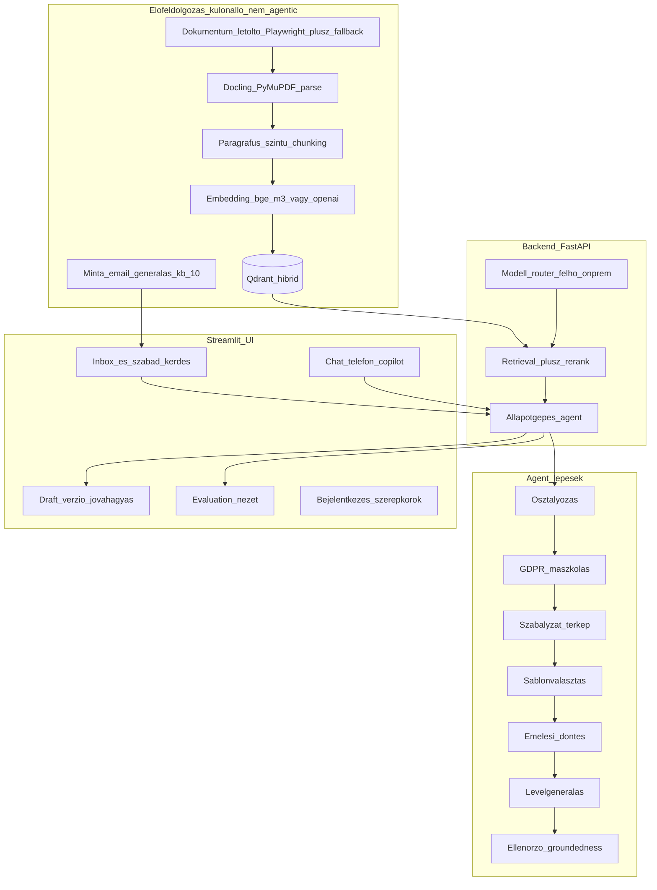

# ÁSZF Q&A Agent — POC megvalósítási terv (magas szint)

> Mentve: 2026-06-06. Forrás üzleti spec: [ASZF_QnA_Agent_uzleti_spec.md](ASZF_QnA_Agent_uzleti_spec.md).
> Ez a terv a tisztázó körök döntéseit konszolidálja. A **részletes frontend-spec** és a **konkrét al-agent katalógus** külön, későbbi lépés — itt az irányt, a határokat és a rögzített tech-stacket fektetjük le.

---

## Feladatlista (todo)

- [ ] **scaffold** — Projektváz: mappastruktúra, requirements, kapcsolható felhő/on-prem config, README
- [ ] **preprocessing** — Előfeldolgozó CLI: ONE dok-letöltő (Playwright + fallback), Docling/PyMuPDF parse, §-szintű chunking, embedding+index, ~10 minta-email generálás
- [ ] **backend-rag** — FastAPI + LlamaIndex RAG backend: hibrid (dense+sparse) retrieval Qdrant felett + rerank + forráshivatkozás, modell-router, válasz-szintézis
- [ ] **agent-statemachine** — LangGraph állapotgépes agent: osztályozás, Presidio GDPR-maszkolás (visszafordítható), szabályzat-térkép, sablonválasztás, emelési döntés, levélgenerálás, ellenőrző
- [ ] **ui** — Streamlit UI váz: inbox + szabad kérdés, agent-idővonal, forráspanel/kiemelés, draft+verzió+jóváhagyás, csatorna-fülek, badge/SLA, konfig-alapú bejelentkezés (ÜI/supervisor aggregált statisztika nézettel)
- [ ] **audit-governance** — Audit naplózás, disclaimer konfig, GDPR megőrzési korlátok, két kimeneti mód
- [ ] **eval-harness** — Referencia-mentes kiértékelő: groundedness, citation support, relevancy, retrieval-support; opcionális szintetikus kérdésbank; Evaluation UI

---

## Rögzített tech-stack és döntések

- **Agent-keretrendszer**: LangGraph (explicit node/állapot, checkpoint, human-in-the-loop megállók).
- **RAG/ingest**: LlamaIndex.
- **Vektor-DB**: Qdrant, **hibrid (dense+sparse) keresés** bekapcsolva (§-számok, szakszavak miatt).
- **Embedding**: `bge-m3` (lokál) / `text-embedding-3-large` (felhő), közös interfész.
- **Reranking**: `bge-reranker-v2-m3` (lokál) / opcionális Cohere.
- **Generálás**: GPT (felhő) ↔ Ollama `Llama 3.3 70B` / `Qwen2.5 72B` (on-prem), kapcsolható router.
- **Perzisztencia**: SQLite (inbox, ügyek, draftok, verziók, audit, userek).
- **Auth**: konfig-alapú felhasználólista jelszóval, szerepkörök: ÜI / supervisor. A **supervisor** emellett **összesített nézetet** lát az ügyintézők statisztikáiról (aggregált dashboard).
- **GDPR**: Microsoft Presidio, **visszafordítható** maszkolás (token↔valós térkép); csak maszkolt szöveg megy (felhős) LLM-be, a valós ügyféladat kiküldés előtt visszakerül az ÜI oldalán.
- **Taxonómia**: hibrid (fix kategória-mag + szabályzati altípusok).
- **Válasz-sablonok**: LLM-generált, **egyszeri emberi jóváhagyással** validált blokk-készlet.
- **SLA**: szabályzatból kinyert határidők, **30 napos fogyasztóvédelmi fallback**, ha nincs explicit talált határidő.
- **UI nyelve**: magyar. **Copilot input**: gépelt szöveg / beillesztett átirat.

## Architektúra áttekintés

## Fázis 0 — Repó- és projektváz
- Python projekt: `pyproject.toml`/`requirements.txt`, mappastruktúra (`preprocessing/`, `backend/`, `agent/`, `ui/`, `eval/`, `data/`, `config/`).
- Központi `config/settings.py`: kapcsolható **felhő (OpenAI) ↔ on-prem (Ollama)** profil embeddinghez, generáláshoz, rerankinghez; Qdrant-kapcsolat, SQLite-útvonal.
- `docker-compose` a Qdrant-hoz; `.env.example`, README a futtatáshoz.

## Fázis 1 — Előfeldolgozás (különálló, nem-agentic CLI)
- **Letöltő**: a 4 aloldal (`#aszf-one`, `#aszf-helyi-kabeles`, `#aszf-ah-media`, `#aszf-invitech`) + „Egyéb felhasználási feltételek" PDF-jeinek felderítése. Mivel `one.hu` WAF + JS-render: **Playwright** headless a fő út; **fallback** kézi URL-lista (`config/doc_sources.yaml`) és helyi `data/raw_pdfs/` mappából való betöltés.
- **Parse + chunk**: Docling/unstructured (layout-tudatos) + PyMuPDF fallback; **paragrafus/§-szintű** chunking, metaadat (szolgáltató, dokumentum, §, verzió/dátum, oldal).
- **Index**: embedding (`bge-m3` lokál / `text-embedding-3-large` felhő) → Qdrant kollekció **hibrid (dense+sparse)** indexszel.
- **Minta-emailek**: ~10 magyar, anonim email generálása (vegyes panasz: számlázás, díjemelés, hibabejelentés, szerződésfelmondás, lefedettség, eszközhiba + nem-panasz példa), `data/sample_emails/`. Valós email megadása is lehetséges (beillesztés/feltöltés).

## Fázis 2 — RAG backend (FastAPI + LlamaIndex)
- **Hibrid retrieval** Qdrant felett (dense + sparse) + **rerank** (`bge-reranker-v2-m3` lokál / opcionális Cohere) → forráshivatkozással (§ + szó szerinti szövegrész + dokumentum-metaadat).
- Modell-router a felhő/on-prem váltáshoz; válasz-szintézis GPT-vel, idézet-kötelezettséggel.
- Endpointok az agent-lépésekhez és a UI-hoz (osztályozás, retrieval, draft, eval).

## Fázis 3 — Állapotgépes agent (LangGraph)
- Lépések eszközhívásokkal: **osztályozás → GDPR-maszkolás → szabályzat-térkép → sablonválasztás → emelési döntés → levélgenerálás → ellenőrző (groundedness)**.
- **Osztályozás**: hibrid taxonómia — fix kategória-mag (számlázás, díjemelés, hibabejelentés/szolgáltatáskiesés, szerződésfelmondás/-módosítás, lefedettség, eszköz/készülék, adatvédelem, egyéb) + szabályzati altípusok.
- **GDPR**: Presidio **visszafordítható** maszkolás feldolgozás előtt (token↔valós térkép); csak maszkolt szöveg megy (felhős) LLM-be, a valós adat a végső levélbe kiküldés előtt visszakerül.
- **Sablonok**: LLM-generált, jóváhagyott blokk-készletből (`config/templates/`); a sablonválasztó rangsorol, az ÜI dönt.
- **SLA/emelés**: határidő a szabályzatból kinyerve, **30 napos fallback**; emelési triggerek és kötelező behivatkozás kódból/konfigból (`config/policies.yaml`), nincs admin-UI.
- Minden lépés állapota és kimenete kinyerhető a UI lépés-idővonalához (LangGraph checkpoint).
- A részletes al-agent katalógus (téma-azonosító, jogi-nyelv egyszerűsítő stb.) **külön spec lépés**.

## Fázis 4 — Streamlit UI (váz; részletes spec később)
- **Belépők**: (a) ügyintézői inbox (lista → ügy nézet), (b) beillesztett email / szabad kérdés.
- **Agent-állapot** lépés-idővonal; **forráspanel** §-ok szó szerinti szövegével; az email szövegében kiemelt, hover-infós hivatkozandó részek.
- **Draft**: verziótörténet + szabad szöveg ÉS strukturált sablonblokkok; „Jóváhagyom kiküldésre" (mock küldés).
- **Csatorna-fülek** (email / chat / telefon copilot); **emelés/konfidencia badge** + **SLA-számláló**.
- Két kimeneti mód: (1) teljes AI-automata → kötelező disclaimer; (2) human-in-the-loop alapeset → disclaimer nem kötelező.
- **Bejelentkezés + szerepkörök** (ÜI / supervisor, konfig-userlista); aktuális ügyintéző neve auditba. A **supervisor** összesített statisztika-nézetet lát az ügyintézőkről.
- Külön **Evaluation** nézet.

## Fázis 5 — Audit és governance
- Kérdés–válasz–forrás–jóváhagyó naplózás; GDPR megőrzési korlát és lekérdezés-napló minimalizálás.
- Fix disclaimer szöveg konfigban.

## Fázis 6 — Kiértékelő harness (gold set nélkül, referencia-mentes)
- **Faithfulness/groundedness**, **citation support rate**, **answer relevancy**, **context precision/recall** (RAGAS-szerű, LLM-as-judge), klasszikus precision@k helyett **retrieval-support** mutató.
- Opcionális: LLM-generált kis **szintetikus kérdésbank** (nem kézi gold) a lefedettség méréséhez.
- Eredmények az Evaluation UI-on és riportként.

## Halasztott, külön spec lépések
- Részletes frontend-spec (komponensek, interakciók, wireframe).
- Konkrét al-agent katalógus és promptok.
- Admin/„betanulási" UI a Dok-paraméterezés jóváhagyásához (POC-ban kódból/konfigból).
