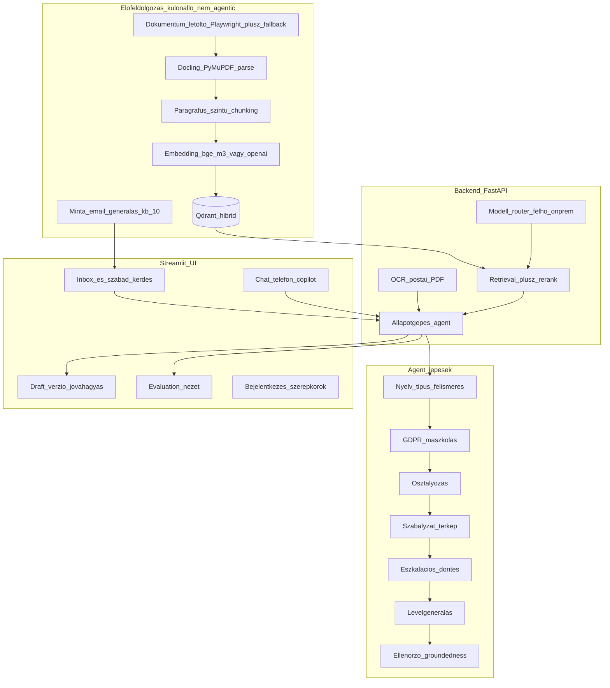

# ÁSZF Q&A Agent — POC megvalósítási terv

> Mentve: 2026-06-06. Forrás üzleti spec: [ASZF_QnA_Agent_uzleti_spec.md](ASZF_QnA_Agent_uzleti_spec.md).
> Ez a terv a tisztázó körök döntéseit konszolidálja: rögzített tech-stack, funkcionális/üzleti döntések, fázisonkénti megvalósítás (modulok, endpointok, agent-node-ok, UI-nézetek, audit, kiértékelés) és compliance/adatbiztonság. A **részletes frontend-spec (wireframe szint)** és a **konkrét al-agent promptkatalógus** külön, későbbi lépés.

---

## Feladatlista (todo)

- [ ] **scaffold** — Projektváz: mappastruktúra, requirements, kapcsolható felhő/on-prem config, README
- [ ] **runtime-observability** — Lokális Windows futtatás (WSL2/Docker), minimális docker-compose (Qdrant [+ Ollama]), Langfuse tracing (agent-lépés/LLM, latency/költség), futtatási sorrend dokumentálva
- [ ] **preprocessing** — Előfeldolgozó CLI: ONE dok-letöltő (Playwright + fallback), Docling/PyMuPDF parse, hierarchikus §-chunking (táblák, kereszthivatkozások, szolgáltató-szeparáció), embedding+index, ~10 minta-email generálás
- [ ] **dok-parameterezes** — Offline származtató CLI: eszkalációs triggerek, kötelező behivatkozások, disclaimer-draft kinyerése a dokumentumokból (forrás-§ provenance), ember által jóváhagyott verziózott YAML-ek
- [ ] **backend-rag** — FastAPI + LlamaIndex RAG backend: hibrid (dense+sparse) retrieval Qdrant felett + rerank + forráshivatkozás, modell-router, válasz-szintézis
- [ ] **postai-ocr** — Postai levél csatorna: PDF-import a UI-on, OCR (Tesseract HU / Docling) konfidenciával, ÜI-korrekciós előnézet, majd belépés az email-flow-ba; PDF+OCR audit
- [ ] **elozmeny-ugyfeltorzs** — Azonos címről jövő email-előzmények (inbox SQLite, maszkolt összegzés az agentnek) + ügyféltörzs-jelölt mock (`CustomerDirectory` interfész) UI-panellel, átlinkeléssel; audit
- [ ] **agent-statemachine** — LangGraph állapotgépes agent: osztályozás, Presidio GDPR-maszkolás (visszafordítható), szabályzat-térkép, sablonválasztás, eszkalációs döntés, levélgenerálás, ellenőrző
- [ ] **ui** — Streamlit UI váz: inbox + szabad kérdés, agent-idővonal, forráspanel/kiemelés, draft+verzió+jóváhagyás, csatorna-fülek (email/chat/telefon/**postai PDF-import + OCR-előnézet**), badge/SLA, konfig-alapú bejelentkezés (ÜI/supervisor aggregált statisztika nézettel)
- [ ] **audit-governance** — Audit naplózás, disclaimer konfig, GDPR megőrzési korlátok, két kimeneti mód
- [ ] **eval-harness** — Referencia-mentes kiértékelő: groundedness, citation support, relevancy, retrieval-support; opcionális szintetikus kérdésbank; Evaluation UI
- [ ] **compliance-security** — Azure OpenAI EU + no-training, maszkolt egress, titkosított de-id térkép, RBAC + PII-láthatóság, prompt-injection védelem, napló-redakció, Art. 22 safeguards, `docs/dpia.md` (DPIA + adatáramlási térkép)
- [ ] **testing** — pytest: dedikált PII-maszkolás tesztkészlet + szivárgás-kapu, unit/integráció, strukturális agent-assertek, adversariális (prompt-injection) tesztek, opcionális pre-commit

---

## Rögzített tech-stack és döntések

- **Agent-keretrendszer**: LangGraph. *Miért:* explicit node/állapot + checkpoint + human-in-the-loop megállók → a kért lépésenkénti láthatóság és a jóváhagyás-kapuk natívan adottak; determinisztikusabb és auditálhatóbb, mint egy szabad agent-loop.
- **RAG/ingest**: LlamaIndex. *Miért:* kész, erős ingest- és citation-primitívek a §-szintű chunkoláshoz és forráshivatkozáshoz; gyorsabb és megbízhatóbb, mint saját pipeline-t építeni.
- **Vektor-DB**: Qdrant, **hibrid (dense+sparse) keresés**. *Miért:* a jogi szövegben a §-számokra és szakszavakra a sparse (kulcsszavas) ág pontosabb találatot ad, mint a tisztán szemantikus keresés; Qdrant production-szerű, mégis egyetlen konténerrel fut.
- **Embedding**: `bge-m3` (lokál) / `text-embedding-3-large` (felhő), közös interfész. *Miért:* a `bge-m3` kiváló többnyelvű (magyar) és hibrid-képes lokálra, az OpenAI erős magyarra a felhős ágon; a közös interfész teszi lehetővé a felhő↔on-prem váltást.
- **Reranking**: `bge-reranker-v2-m3` (lokál) / opcionális Cohere. *Miért:* a rerank érdemben emeli a retrieval pontosságát (közvetlenül a citation/accuracy KPI-kat), és a `bge` páros koherens, lokál-barát stacket ad.
- **Generálás**: **elsődlegesen Azure OpenAI (EU régió)** GPT (DPA + no-training); **on-prem opció demóként** Ollamával, kisebb modellen (`Qwen2.5`/`Llama`), kapcsolható router. *Miért:* a felhő adja a legjobb magyar minőséget és sebességet, EU-rezidencia + no-training fedi a compliance-t; az on-prem ág demonstrálja az adatszuverén alternatívát vendor-lock-in nélkül.
- **Observability**: **Langfuse** (self-hosted). *Miért:* a többlépéses agentet trace nélkül nehéz debugolni és mérni; a self-hosted megoldásnál az adat nálunk marad, és méri a `<30 mp` time-to-answer KPI-t és a költséget.
- **Perzisztencia**: SQLite (inbox, ügyek, draftok, verziók, audit, userek; az emailek **feladó-címmel és ügy-kapcsolattal** az előzmény-lekérdezéshez). *Miért:* nulla üzemeltetés, fájlalapú, elég a POC párhuzamossági igényéhez; egyértelmű migrációs út Postgresre prod-ban.
- **Auth**: konfig-alapú felhasználólista jelszóval (ÜI / supervisor); a **supervisor** összesített statisztika-nézetet is lát. *Miért:* a POC audit-igényéhez (ki járt el / ki hagyott jóvá) elég, de nem visz be fölösleges OAuth-komplexitást.
- **GDPR**: Microsoft Presidio, **visszafordítható** maszkolás (token↔valós térkép). *Miért:* adatminimalizálás miatt csak maszkolt PII mehet (felhős) LLM-be, ám a valós névnek vissza kell kerülnie a kiküldendő levélbe → visszafordítható térkép kell; a Presidio gyors, determinisztikus és többnyelvű.
- **OCR (postai levél)**: Tesseract (magyar nyelvi csomag) + Docling OCR-útvonal, **konfidenciával és ÜI-korrekciós előnézettel**. *Miért:* a postai csatorna szkennelt PDF-eket hoz; az OCR-hibák jellemzőek, ezért az ÜI a felismert szöveget feldolgozás előtt javíthatja (a hibás szöveg rossz osztályozást/választ adna).
- **Taxonómia**: hibrid (fix kategória-mag + szabályzati altípusok). *Miért:* a fix mag mérhető és kiszámítható (eval), a szabályzati altípusok a valós ÁSZF-struktúrához illeszkednek → pontosabb kötelező behivatkozás.
- **Válasz-sablonok**: LLM-generált, **egyszeri emberi jóváhagyással** validált blokk-készlet. *Miért:* az ÁSZF nem tartalmaz válaszlevél-sablont, ezért generálni kell; a jogi kockázat miatt élesítés előtt egyszeri emberi validáció szükséges.
- **SLA**: szabályzatból kinyert határidők, **30 napos fogyasztóvédelmi fallback**. *Miért:* a dokumentumból kinyert határidő a leghűebb, de ahol nincs explicit, a 30 napos fogyasztóvédelmi gyakorlat a biztonságos alapérték.
- **UI nyelve**: magyar; **Copilot input**: gépelt szöveg / beillesztett átirat. *Miért:* a célfelhasználó magyar ÜI; a feliratozás szimulált, ezért a gépelt/beillesztett szöveg a reális POC-bemenet.

## Rögzített funkcionális / üzleti döntések

- **Osztályozás**: nulláról. *Miért:* önálló, demonstrálható POC külső függés nélkül; az előosztályozó integrációja későbbi és szimulálható, nem blokkolja az értékbizonyítást.
- **Eszkaláció**: eszkalált ügy **supervisor-sorba** kerül. *Miért:* valódi átadási folyamat demonstrálja a felelősség-átadást és a szerepköröket, nem csak egy jelzés a felületen.
- **Konfidencia**: konfigurálható küszöb, alatta **automatikus eszkaláció**. *Miért:* átlátható, hangolható biztonsági háló a bizonytalan válaszok ellen (közvetlenül az escalation-appropriateness KPI-t szolgálja).
- **Nem-panasz email**: felismerés + rövid válaszjavaslat + „nem panasz" címke. *Miért:* a valós inbox vegyes; a megkülönböztetés elkerüli a fölösleges panasz-feldolgozást és demonstrálja a robusztusságot.
- **Hatókörön kívüli / megválaszolhatatlan kérdés**: elutasítás + eszkaláció, **nincs „biztos" állítás**. *Miért:* a „nem tudom + eszkaláció" megelőzi a hallucinációt (hallucináció=0 KPI) és megfelel az AI Act tájékoztató-szerep elvnek.
- **Email-mellékletek**: POC-ban csak jelzés (nem OCR-ezzük). *Miért:* a mellékletek nem kritikusak a RAG-érték bizonyításához → későbbre tolva. (A **postai levél** OCR-je ezzel szemben POC-scope, mert ott a PDF maga a beérkező üzenet.)
- **Postai levél**: PDF-import a UI-on → OCR → ÜI-korrekciós előnézet → belép az email-flow-ba. *Miért:* a postai panasz aszinkron, mint az email; közös feldolgozás kevesebb logika, az OCR-előnézet kezeli a szkennelési hibákat.
- **Ügy-összevonás**: **manuális** összekapcsolás ügy-azonosítóval. *Miért:* az automata dedup hibázhat és félrevezethet; a kontrollált, manuális összekapcsolás biztonságosabb és elég a POC-hoz.
- **Szabályzat-térkép (ÜI nézet)**: releváns §-ok + kötelező behivatkozások + alkalmazandó szabályzatok, forrással. *Miért:* ez a belső copilot lényegi értéke — gyors, forrásolt áttekintés az ÜI-nak, ami csökkenti a keresési időt és a hibát.
- **Kötelező behivatkozás kihagyása**: az agent **figyelmeztet, de nem blokkol**. *Miért:* az alapelv szerint az ÜI felel a végső szövegért; a blokkolás merev lenne és akadályozná a munkát.
- **Levél hangneme**: hivatalos, udvarias magyar, konfigurálható. *Miért:* ez az elvárt ügyféllevél-regiszter; a konfigurálhatóság a szervezeti stílushoz igazítást teszi lehetővé.
- **Disclaimer**: jogilag óvatos draft, üzleti/jogi véglegesítéssel. *Miért:* a tartalmi felelősség a szervezeté (Fgytv./AI Act), ezért a végső szöveget jognak kell jóváhagynia; mi gyors, óvatos kiindulást adunk.
- **Dokumentum-verziókezelés**: egy aktuális verzió, verzió/dátum metaadattal. *Miért:* a POC az aktuális ÁSZF-re fókuszál; a több-verziós kezelés bonyolítja, üzleti értéke későbbi (elavult-hivatkozás elleni védelem prod-ban).
- **Hatókör**: tájékoztatás **+ javasolt intézkedés**, kockázat-szintezve. *Miért:* az ÜI-nak a konkrét következő lépés ad valódi értéket; a kockázat-szintezés kezeli a jogi kitettséget (lásd lentebb).
- **ÜI-visszajelzés**: strukturált (jó/rossz, rossz forrás). *Miért:* gold set hiányában ez méri a minőséget és táplálja a betanulást/finomítást.
- **Válaszlevél**: teljes, formázott email. *Miért:* a kiküldésre kész kimenet a végpontig-értéket demonstrálja, nem csak töredéket; reálisan értékelhető és jóváhagyható.
- **Telefon/chat copilot kimenet**: beszédpontok + forrás. *Miért:* telefonon/chaten az ÜI a saját szavaival kommunikál; a szó szerinti script merev és természetellenes lenne.
- **Jogi nyelv**: szó szerinti § + közérthető magyarázat. *Miért:* gyorsítja az ÜI megértését és az ügyfélnek érthető választ támogat, miközben a § pontossága megmarad (auditálhatóság).
- **Ügy-státusz workflow**: új → folyamatban → eszkalálva → jóváhagyásra vár → lezárva. *Miért:* átlátható ügykezelés és mérhető folyamat (handle time, lezárási arány).
- **Prioritás triázs**: agent javasol (sürgős/normál), inbox-rendezés. *Miért:* az SLA-veszélyes vagy súlyos ügyek előre kerülnek → határidő-tartás és kockázatcsökkentés.
- **SLA**: figyelmeztetés + automatikus eszkaláció supervisorhoz lejáratkor. *Miért:* a fogyasztóvédelmi határidő elmulasztása jogi/reputációs kockázat; a proaktív eszkaláció ezt védi ki.
- **Tudás-frissítés**: manuális „újraindexelés" gomb/CLI + verzió/dátum. *Miért:* kontrollált és demózható; az automata periodikus letöltés WAF-érzékeny és fölöslegesen bonyolult a POC-ban.
- **Idegen nyelvű email**: felismerés + jelzés, magyar válasz. *Miért:* a scope magyar, de a felismerés megelőzi a téves feldolgozást és átlátható marad a korlát.
- **ÜI szerkeszthet**: levélszöveg + forrás-hivatkozások. *Miért:* az ÜI felel a végső tartalomért, ezért teljes kontroll kell a szöveg és a hivatkozások felett is.
- **Dokumentumtípus a hivatkozásnál**: ÁSZF / melléklet / „Egyéb felhasználási feltételek" megjelölve. *Miért:* ezek eltérő jogi súlyúak; a megkülönböztetés a pontos hivatkozást és a félrevezetés elkerülését szolgálja.

### Intézkedés-végrehajtás governance (eldőlt)

- **Kockázat-szintezett modell**: alacsony kockázatú intézkedés **automatikus végrehajtható (mock)** a teljes AI-automata módban; közepes/magas kockázatú **mindig emberi jóváhagyást** igényel. *Miért:* a kockázattal arányos kontroll — a triviális lépéseknél nem kell emberi szűk keresztmetszet, a pénzügyi/jogi következményű lépéseknél viszont kötelező az emberi felelős (Art. 22 / Fgytv.).
- **Engedélyezett intézkedés-típusok a POC-ban**: (a) önkiszolgáló-link / GYIK / tájékoztatás, (b) visszahívás / technikus időpont ajánlása. **Jóváírás/kompenzáció és szerződésfelmondás NEM engedélyezett intézkedésként** — ezeknél az agent eszkalál. *Miért:* az engedélyezett kör visszafordítható, alacsony kárpotenciálú; a pénzügyi/jogi kötelmet keletkeztető lépéseket tudatosan emberhez tereljük, hogy a POC ne hozzon kötelező érvényű döntést.
- **Audit**: minden javasolt és (mock) végrehajtott intézkedés naplózva — ki, mikor, mit, mely módban. *Miért:* visszakövethetőség és felelősség-tisztázás (compliance és incidenskezelés).
- A POC-ban valós CRM/számlázó hiányában a végrehajtás mock. *Miért:* nincs éles integráció, a cél a folyamat és a governance bemutatása, nem valós tranzakció.

## Architektúra áttekintés

## Fázis 0 — Repó- és projektváz
- Python projekt (`pyproject.toml` vagy `requirements.txt`), modulstruktúra a komponensekhez:
  - `preprocessing/` — letöltő, parser, chunker, indexelő, minta-email generátor (CLI belépőkkel).
  - `backend/` — FastAPI app, retrieval/rerank szolgáltatás, modell-router, citation-építő.
  - `agent/` — LangGraph gráf, node-ok (osztályozás, maszkolás, szabályzat-térkép, sablon, eszkaláció, levél, ellenőrző), állapot-séma, checkpoint.
  - `security/` — Presidio maszkoló + de-id térkép kezelő, napló-redakció, RBAC-ellenőrzés.
  - `integrations/` — adapter-interfészek + mock implementációk: `CaseStore` (ticketing/CRM), email-adapter (be/ki), `CustomerDirectory` (ügyféltörzs email alapján).
  - `ui/` — Streamlit app, nézetenként külön modul (inbox, ügy, copilot, evaluation, login).
  - `eval/` — referencia-mentes kiértékelő futtató + riport.
  - `data/` — `raw_pdfs/`, `processed/`, `sample_emails/`, `postal_pdfs/` (postai importok), SQLite fájl.
  - `config/` — `settings.py`, `doc_sources.yaml`, `policies.yaml`, `mandatory_refs.yaml`, `individual_contract_terms.yaml` (kézi), `templates/`, `users.yaml`, `disclaimer.yaml`.
  - `docs/` — `dpia.md` (DPIA + adatáramlási térkép).
- **`config/settings.py`**: profilváltó (`PROVIDER=cloud|onprem`) embeddinghez, generáláshoz, rerankinghez; Azure OpenAI EU vs. Ollama endpoint; Qdrant-kapcsolat (hibrid keresés ki/be); SQLite-útvonal; konfidencia-küszöb; SLA-alapérték (30 nap); retention-paraméterek.
- `docker-compose.yml` a Qdrant-hoz (és opcionálisan Ollamához); `.env.example` (kulcsok, endpointok); README a futtatáshoz (előfeldolgozás → backend → UI sorrend).

## Fázis 1 — Előfeldolgozás (különálló, nem-agentic CLI)
- **Letöltő** (`preprocessing/download.py`): a 4 aloldal (`#aszf-one`, `#aszf-helyi-kabeles`, `#aszf-ah-media`, `#aszf-invitech`) + „Egyéb felhasználási feltételek" PDF-linkjeinek felderítése. Mivel `one.hu` WAF + JS-render: **Playwright** headless a fő út (renderelés után a `/static/documents/...` linkek begyűjtése); **fallback** a `config/doc_sources.yaml` kézi URL-listából és a `data/raw_pdfs/` mappába kézzel bemásolt PDF-ekből. A letöltött fájlokhoz forrás-URL, aloldal (szolgáltató), letöltési dátum metaadat.
- **Parse + chunk** (`preprocessing/parse.py`): Docling/unstructured (layout-tudatos) + PyMuPDF fallback.
  - **Hierarchikus, parent-child chunking** (§ az alap egység + szülő-szakasz/fejezet kontextus; „small-to-big" retrieval). *Miért:* a § pontos hivatkozást ad, de a helyes válaszhoz gyakran kell a tágabb kontextus → jobb pontosság és citation.
  - **Táblázatok** Docling tábla-kinyeréssel, **markdown táblaként** a chunkban. *Miért:* a díj-/díjcsomag-táblák kulcsfontosságúak a számlázási/díjemelési panaszoknál; a szerkezet megőrzése nélkül félreérthetők.
  - **Kereszthivatkozás-metaadat**: a §-ban szereplő „a X.Y pont szerint" hivatkozások kigyűjtve (a feloldás retrievalkor történik — lásd Fázis 2). *Miért:* a jogi szöveg sűrűn hivatkozik más §-okra; e nélkül a válasz hiányos.
  - **Chunk-metaadat**: `szolgaltato` (ONE/helyi kábeles/AH Média/Invitech), `dok_tipus` (ÁSZF / melléklet / „Egyéb felhasználási feltételek"), `dok_cim`, `paragrafus_szam` (§), `szulo_szakasz`, `cross_refs[]`, `verzio`/`hatalyba_lepes_datum`, `oldalszam`.
- **Index** (`preprocessing/index.py`): embedding (`bge-m3` lokál / `text-embedding-3-large` felhő) → Qdrant kollekció **hibrid (dense+sparse)** indexszel; a sparse ág a §-számok és szakszavak pontos találatát segíti. A **4 szolgáltató klauzulái külön maradnak**, `szolgaltato`-szűrhetően. *Miért:* a közel azonos szövegek keveredése félrevezető választ adna — mindig a helyes szolgáltató feltételeit kell idézni. Verzió/dátum a payloadban (újraindexeléshez).
- **Minta-emailek** (`preprocessing/gen_emails.py`): **LLM-generált, fix katalógusból, verziózva**, fájlonként metaadattal; `data/sample_emails/`.
  - **~10 fő panasz** a fix taxonómia kategóriáira (számlázás, díjemelés, hibabejelentés/szolgáltatáskiesés, szerződésfelmondás/-módosítás, lefedettség, eszköz/készülék, adatvédelem) **+ 4–6 edge-case**: egyedi-szerződés gyanú, idegen nyelvű, hatókörön kívüli, többcsatornás ugyanazon ügy, beágyazott prompt-injection kísérlet, nem-panasz. *Miért:* ezek mérik/demonstrálják a kritikus ágakat (eszkaláció, elutasítás, maszkolás, biztonság).
  - **Címkézés**: minden minta várt kimenettel (kategória / szolgáltató / eszkaláció-e). *Miért:* gold-szerű referencia kézi annotáció nélkül az osztályozás- és escalation-eval-hez.
  - **Beágyazott reális (fake) magyar PII** (jól formált, de egyértelműen kitalált név/cím/ügyfél-/SIM-/telefonszám). *Miért:* a maszkolás-tesztek valós inputon mérnek.
  - Valós email megadása (beillesztés/feltöltés) is támogatott a UI-on.

## Fázis 1b — Dok-paraméterezés (offline származtatás)

A spec központi ígérete: a determinisztikusan előre nem rögzíthető szabályok **dokumentum-alapú, auditálható javaslatként** álljanak elő. Külön, offline CLI (`preprocessing/derive_params.py`).

- **Módszer**: LLM-kinyerés az indexelt dokumentumokból → **ember által jóváhagyott** konfig-fájlok. *Miért:* teljesíti a spec dok-vezérelt ígéretét, mégis kontrollált és auditálható.
- **Mikor**: offline lépés, **verziózott** kimenettel; újraindexeléskor újrafuttatható. *Miért:* reprodukálható és stabil (nem hívásonkénti, drága származtatás).
- **Származtatott konfigok** (mind **forrás-§ provenance**-szal):
  - eszkalációs triggerek → `config/policies.yaml`
  - kötelező behivatkozások kategóriánként → `config/mandatory_refs.yaml`
  - disclaimer-draft → `config/disclaimer.yaml`
- **Egyedi-szerződés jelző fogalmak**: a POC-ban **nem** automatikusan származtatott — kézi/triggerek része marad. *Miért:* érzékeny, jogi megítélésű lista; biztonságosabb emberi kézben tartani.
- **Jóváhagyás**: fájl-review + sign-off (git diff), mivel admin-UI a POC-ban nincs. *Miért:* kontrollált, a fejlesztői folyamatba illeszkedő jóváhagyás.
- **Provenance**: minden származtatott szabály megjelöli a forrás-§-t. *Miért:* visszavezethetőség és auditálhatóság.

## Fázis 2 — RAG backend (FastAPI + LlamaIndex)
- **Hibrid retrieval** Qdrant felett (dense + sparse) + **rerank** (`bge-reranker-v2-m3` lokál / opcionális Cohere). A találat forráshivatkozással tér vissza: **§-szint + szó szerinti idézett szövegrész** + dokumentum-metaadat (`szolgaltato`, `dok_tipus`, `verzio/datum`, `oldalszam`). *Miért:* a szó szerinti idézet ellenőrizhető, auditálható hivatkozást ad (citation KPI).
- **Szolgáltató-szűrés**: az agent az emailből kikövetkezteti az érintett szolgáltatót/szolgáltatást, és arra szűr; **az ÜI felülírhatja**. *Miért:* pontosság (nem keverednek a szolgáltatók feltételei) + emberi kontroll.
- **Kereszthivatkozás-feloldás**: ha a top találat más §-ra hivatkozik (`cross_refs`), a hivatkozott §-t is behúzzuk a kontextusba. *Miért:* a „a X.Y pont szerint" típusú utalások nélkül a válasz hiányos lenne.
- **Modell-router** (`backend/router.py`): a `PROVIDER` profil szerint Azure OpenAI (EU) vagy Ollama; válasz-szintézis idézet-kötelezettséggel (minden tartalmi állításhoz forrás), a `dok_tipus` megjelenítésével.
- **Konkrét endpointok (vázlat):**
  - `POST /ocr` — postai PDF szövegfelismerése (Tesseract HU / Docling), konfidenciával; a kimenet az ÜI-korrekció után lép a feldolgozásba.
  - `GET /history?address=` — az adott email címről érkezett korábbi üzenetek (dátum, tárgy, kategória, státusz) + maszkolt összegzés az agentnek.
  - `GET /customer-lookup?address=` — **mock** ügyféltörzs-jelöltek (azonosító, név, átlinkelési URL) egy `CustomerDirectory` interfész mögött.
  - `POST /classify` — kategória + konfidencia + (több jelölt bizonytalanságnál).
  - `POST /mask` és `POST /unmask` — Presidio maszkolás / visszafejtés (RBAC mögött).
  - `POST /retrieve` — hibrid keresés + rerank, forrásokkal.
  - `POST /policy-map` — releváns §-ok + kötelező behivatkozások + alkalmazandó szabályzatok.
  - `POST /draft` — válaszlevél/copilot-javaslat generálás (sablonblokkok + idézetek + disclaimer mód szerint).
  - `POST /verify` — groundedness/citation-ellenőrzés a draftra.
  - `POST /eval/run` — kiértékelő futtatás.
  - `POST /reindex` — tudás-frissítés (újraindexelés, verzió/dátum frissítés).
- **Visszakövethetőség**: minden válasz mellé rögzül a használt modell, promptverzió és ÁSZF-verzió (audit + Evaluation).

## Fázis 3 — Állapotgépes agent (LangGraph)

A gráf node-jai (sorrendben), eszközhívásokkal és a Fázis 2 endpointokra támaszkodva. Minden node kimenete bekerül a LangGraph állapotba és a UI lépés-idővonalába (checkpoint).

> **Csatorna-intake**: a **postai levél** ágon a gráf előtt fut az **OCR** (`/ocr`) + **ÜI-korrekciós előnézet**; a javított szöveg ugyanúgy lép az 1. node-ba, mint egy email. Így a postai csatorna nem igényel külön agent-logikát.

1. **Nyelv- és típusfelismerés**: idegen nyelvű email → jelölés, de a feldolgozás/válasz magyarul; **nem-panasz** detektálás → „nem panasz" címke + rövid válaszjavaslat-ág.
2. **GDPR-maszkolás** (Presidio, visszafordítható): a maszkolás a legelső érdemi lépés; a token↔valós térkép a `security/` titkosított tárba kerül; innentől csak maszkolt szöveg megy (felhős) LLM-be.
3. **Osztályozás**: hibrid taxonómia — fix kategória-mag (számlázás, díjemelés, hibabejelentés/szolgáltatáskiesés, szerződésfelmondás/-módosítás, lefedettség, eszköz/készülék, adatvédelem, egyéb) + szabályzati altípusok; **konfidencia** is. Bizonytalanságnál több kategória + forrás.
4. **Prioritás-triázs**: sürgős/normál javaslat (pl. SLA-közeli, jogi/hatósági jel) → inbox-rendezéshez.
5. **Szabályzat-térkép**: releváns §-ok + **kötelező behivatkozások** + alkalmazandó szabályzatok, forrással és `dok_tipus`-szal; a jogi szöveg mellé **közérthető magyarázat**.
6. **Eszkalációs döntés**: `config/policies.yaml` triggerek (egyedi szerződés gyanú, vitatott összeg, ismétlődő panasz, jogi/hatósági/média, **konfidencia < küszöb**, SLA-lejárat) → eszkaláció a supervisor-sorba. **Hatókörön kívüli/megválaszolhatatlan** kérdés → elutasítás + eszkaláció, „biztos" állítás nélkül.
7. **Sablon- és intézkedés-javaslat**: sablonválasztó rangsorol a `config/templates/` LLM-generált, jóváhagyott blokk-készletből (ÜI dönt). Intézkedés-javaslat a kockázat-szintezett modell szerint (engedélyezett: önkiszolgáló/tájékoztatás, visszahívás/technikus; jóváírás/felmondás → eszkaláció).
8. **Levél-/copilot-generálás**: email-ágon teljes formázott levél (tárgy, megszólítás, törzs, intézkedés, disclaimer mód szerint, aláírás); copilot-ágon beszédpontok + forráshivatkozás.
9. **Ellenőrző (groundedness)**: minden tartalmi állítás visszavezethető-e a forrásra; kötelező behivatkozás hiányában **figyelmeztetés** (nem blokkol).
10. **Unmask + jóváhagyás-előkészítés**: a valós ügyféladat a végső szövegbe a kiküldés-előtti jóváhagyásnál kerül vissza (RBAC mögött).

- **SLA**: határidő a szabályzatból kinyerve, **30 napos fallback**, ha nincs explicit talált határidő.
- **Előzmény-kontextus**: a `/history` maszkolt összegzése bekerül az állapotba; az **osztályozás** és az **eszkalációs döntés** (ismétlődő panasz trigger) felhasználja. *Miért:* a korábbi azonos-című ügyek érdemben befolyásolják a kategóriát és az eszkalációt.
- A részletes al-agent katalógus és a node-promptok: lásd [ASZF_QnA_Agent_prompt_katalogus.md](ASZF_QnA_Agent_prompt_katalogus.md) (magyar promptok, node-onkénti JSON séma).

## Fázis 4 — Streamlit UI (részletes spec: [ASZF_QnA_Agent_frontend_spec.md](ASZF_QnA_Agent_frontend_spec.md))
- **Belépők / nézetek**:
  - (a) **Ügyintézői inbox**: bejövő emailek listája, kategória-, prioritás- (sürgős/normál) és státusz-jelöléssel; rendezés prioritás/SLA szerint; szűrés. Sorból → ügy nézet.
  - (b) **Szabad bevitel**: beillesztett email vagy szabad szöveges kérdés ad-hoc feldolgozása.
- **Ügy nézet**:
  - **Agent-állapot lépés-idővonal** (a Fázis 3 node-jai, kimenetekkel).
  - **Forráspanel**: a hivatkozott §-ok szó szerinti szövege + `dok_tipus` (ÁSZF / melléklet / „Egyéb felhasználási feltételek") jelölés, ugorható kattintás; a jogi szöveg mellett **közérthető magyarázat** kapcsoló.
  - Az email törzsében **kiemelt** hivatkozandó szövegrészek, **hover**-infóval.
  - **Előzmények panel**: az azonos email címről érkezett korábbi üzenetek (dátum, tárgy, kategória, státusz), kattintással megnyitható; jelzi, ha ismétlődő panasz. *Miért:* kontextus az ÜI-nak és az eszkalációs döntéshez.
  - **Ügyféltörzs-jelöltek panel**: a címhez tartozható ügyfelek **azonosító + név** listája **átlinkeléssel** (POC-ban mock). Egy jelölt kiválasztása **szolgáltatóra szűkítheti** a keresést. *Miért:* gyors ügyfél-azonosítás + pontosabb retrieval; helyet tart a jövőbeli valós integrációnak.
  - **Badge-ek**: kategória, prioritás, **konfidencia**, **eszkaláció** jelzés; **SLA-számláló** (lejáratkor automatikus eszkaláció supervisorhoz).
- **Draft-szerkesztő**: **verziótörténet** (iterációk), **szabad szöveg ÉS strukturált sablonblokkok**; az ÜI a forrás-hivatkozásokat hozzáadhatja/elveheti; **kimeneti mód** választó: (1) teljes AI-automata → kötelező disclaimer, (2) human-in-the-loop alapeset → disclaimer opcionális; „Jóváhagyom kiküldésre" (mock küldés, verzió rögzítése).
- **ÜI-visszajelzés**: jó/rossz + „rossz forrás" jelölés a válaszokra (betanulás/KPI).
- **Csatorna-fülek**: email / chat-copilot / telefon-copilot / **postai levél**. A postai fül: **PDF-feltöltő** → OCR-eredmény **szerkeszthető előnézete** (konfidencia-jelzéssel) → „Feldolgozás" gomb, ami a javított szöveget az email-flow-ba küldi. *Miért:* az OCR hibázhat, ezért az ÜI a feldolgozás előtt javíthat; innentől a megszokott ügy-nézet (agent-idővonal, forráspanel, draft).
- **Bejelentkezés + szerepkörök** (konfig `users.yaml`): ÜI / supervisor; aktuális ügyintéző neve auditba. **Supervisor**: eszkalált ügyek **sora** + **összesített statisztika-nézet** az ügyintézőkről.
- **Tudás-frissítés**: „újraindexelés" gomb (`/reindex`) + aktuális ÁSZF-verzió/dátum kijelzés.
- Külön **Evaluation** nézet (lásd Fázis 6).

## Fázis 5 — Audit és governance
- **Audit-rekord tartalma** (ügyenként/iterációnként): kérdés/bejövő (maszkolt), **csatorna** (email/chat/telefon/postai), **postai ágon**: eredeti PDF-referencia + nyers OCR-szöveg + OCR-konfidencia + ÜI-javított szöveg, **figyelembe vett email-előzmények** (azonosítók) + **kiválasztott ügyféltörzs** (ha az ÜI választott), válasz/draft, idézett források (§ + `dok_tipus`), kategória + konfidencia, **eszkaláció** ténye/oka, **javasolt és (mock) végrehajtott intézkedés** (ki/mikor/mit/mely mód), jóváhagyó ügyintéző + időbélyeg + jóváhagyott verzió, **modell/promptverzió/ÁSZF-verzió**, kimeneti mód (automata/HITL), ÜI-visszajelzés.
- **Ügy-státusz workflow** perzisztálva: új → folyamatban → eszkalálva → jóváhagyásra vár → lezárva.
- **RBAC**: maszkolatlan PII és `unmask` csak jogosult szerepkörnek; minden ilyen hozzáférés naplózva.
- **Napló-redakció**: a logok/tracek csak maszkolt szöveget tárolnak.
- **Disclaimer**: fix, jogilag óvatos szöveg `config/disclaimer.yaml`-ben; automata módban kötelezően ráillesztve, HITL módban opcionális.
- **GDPR Art. 22**: automata módú döntés naplózva + átláthatósági megjelölés; megőrzési politika dokumentálva (POC), prod-ban auto-purge + érintetti törlés.

## Fázis 6 — Kiértékelő harness (gold set nélkül, referencia-mentes)
- **Metrikák** (RAGAS-szerű, LLM-as-judge):
  - **Faithfulness/groundedness** → a spec „Hallucination / critical error = 0% kritikus" KPI-ja.
  - **Citation support rate** (van-e és a tényleges chunkra mutat-e) → „Source citation rate ≥95%".
  - **Answer relevancy** + LLM-judge rubrika (1–5) → „Answer accuracy ≥4.0" proxyja.
  - **Context precision/recall** (gold helyett kérdés↔visszakeresett chunk önkonzisztenciából) → klasszikus precision@k helyett **retrieval-support**.
  - **Coverage** a szintetikus kérdésbankon (használható válasz aránya) → „Coverage ≥80%".
  - **Escalation appropriateness** (helyes eszkaláció bizonytalannál/triggernél) → „≥90%".
  - **Time-to-answer** mérés → „<30 mp".
- **LLM-as-judge**: a generálótól **külön bíró-modell**. *Miért:* csökkenti az „önmagát preferáló" torzítást. A judge-ot kalibrációs készlet nélkül, adottnak vesszük (POC-egyszerűsítés; prod-ban érdemes emberi-címkézett kalibráció).
- **Faithfulness/groundedness**: **állítás-szintű bontás** — minden tartalmi állítást a visszakeresett forrás ellen ellenőrzünk. *Miért:* precízen megmutatja a nem-megalapozott állítást, nem csak egy összpontszámot.
- **Szintetikus kérdésbank**: LLM-generált kérdés→várt §-hivatkozás az indexelt ÁSZF-ből, **kategória + szolgáltató szerint rétegezve** (nem kézi gold). *Miért:* lefedettség-arányos, reprodukálható coverage-mérés.
- **Adversariális / red-team készlet**: prompt-injection, hatókörön kívüli és egyedi-szerződés esetek. *Miért:* a kritikus biztonsági/scope-kontrollokat is méri, nem csak a „boldog utat".
- **Regresszió**: **verziózott baseline + diff-riport** ÁSZF/prompt/modell változáskor. *Miért:* látszik, mit rontott vagy javított egy változás.
- **Emberi spot-check**: opcionális **1–5 értékelés az Evaluation UI-on** (az „Answer accuracy" KPI-hez). *Miért:* gold set hiányában kis mintán emberi horgonyt ad a metrikának.
- **Kockázat-KPI-k**: out-of-scope answer rate, version mismatch (0), audit completeness (100%).
- Eredmények az **Evaluation UI**-on (kérdés-szinten: groundedness, citation flag, retrieval-support, judge-pontszám, opcionális emberi 1–5) és exportálható riportként.

## Tesztelési stratégia
- **PII-maszkolás (kiemelt)**: dedikált magyar PII-tesztkészlet (nevek, címek, ügyfél-/SIM-/számla-/telefonszám, email) + **„nincs szivárgás" kapu** (maszkolatlan PII nem juthat a felhős promptba) + visszafejtés-helyesség. *Miért:* a maszkolás hibája kritikus PII-szivárgás a felhőbe — ez a legnagyobb adatbiztonsági kockázat.
- **Scope**: **unit** (maszkolás, policy-logika, citation-építő, chunk-metaadat), **integráció** (retrieval, agent-gráf végpontig a minta-emaileken), és az **eval-harness mint minőség-kapu**. *Miért:* a végpontig-működést és a minőséget is fedi, nem csak az izolált egységeket.
- **Agent-kimenet**: **strukturális assertek** (van citation; automata módban van disclaimer; trigger → eszkaláció). *Miért:* stabil az LLM szövegvariációjával szemben, szemben a törékeny snapshot-tal.
- **Adversariális / biztonsági**: prompt-injection tesztek — ne szivárogtasson, ne törje az instrukció-hierarchiát. *Miért:* a bejövő email nem megbízható input; a védelem bizonyítása szükséges.
- **Futtatás**: `pytest` lokálisan + opcionális **pre-commit a PII-kapura**. *Miért:* megbízható, ismételhető; a PII-kapu megelőzi a véletlen regressziót.

## Üzemeltetés és futtatási architektúra

### Cél-környezet
- **Elsődlegesen lokális Windows gép** a fejlesztéshez/demóhoz; a Linux-igényű, állapottartó szolgáltatások **WSL2 / Docker** alatt. Később opcionálisan **felhős VM**.
- **Modellek**: elsődlegesen **Azure OpenAI (EU)** (felhő); az **on-prem ág demóként** Ollamával, kisebb modellen (a kapcsolható router miatt a kód mindkettővel megy).

### Komponensek futása
- **FastAPI backend** és **Streamlit UI**: lokális Python virtuális környezetben.
- **Qdrant** (és opcionálisan **Ollama**): **Dockerben** (minimális konténerezés — az app lokálisan fut).
- **Langfuse**: self-hosted tracing (saját compose), vagy felhős free tier; az agent-lépések és LLM-hívások trace-elése, latency/költség mérés.
- **SQLite**: fájlalapú, a backend mellett.

### Konfiguráció és futtatási sorrend
- `PROVIDER=cloud|onprem` profil (Azure OpenAI vs. Ollama) `config/settings.py` + `.env`.
- Sorrend: (1) `docker compose up` (Qdrant [+ Ollama]) → (2) előfeldolgozó CLI (letöltés/parse/index/minta-emailek) → (3) FastAPI backend → (4) Streamlit UI. Külön opcionális Langfuse indítás.
- README a teljes lokális setuphoz (WSL2/Docker megjegyzésekkel).

### Hermes Agent / OpenClaw — értékelés (megvizsgálva, POC-ban NEM adoptálva)
- **Mi ez**: local-first, BYOM (Ollama), többcsatornás, sandboxolt, always-on autonóm agent-gateway keretek (Hermes Agent — Nous Research; OpenClaw — korábban Clawdbot/Moltbot); MIT licenc, heartbeat-ütemező, skill/plugin rendszer.
- **Döntés**: a POC magját a kontrollált **LangGraph + custom runtime** adja. Indok: a mi alapelvünk **szigorú human-in-the-loop, nincs közvetlen ügyfél-kontakt, nincs autonóm végrehajtás**, és a választott **explicit, lépésenként látható állapotgép**; egy autonóm/self-improving keret **növelné az auditálandó felületet** és ütközne a compliance-kapukkal. A domain-UI (inbox/ügy/eval) és a PII/GDPR-réteg amúgy is saját fejlesztés.
- **Mikor érdemes újra megfontolni** (későbbi fázis): többcsatornás **chat/telefon-gateway** becsatlakoztatása és **SLA-heartbeat** ütemezés — ezekre az OpenClaw gateway természetesen illeszkedne, a mi LangGraph-agentünket skillként/eszközként meghívva. Igény esetén egy **timeboxolt spike** mérheti fel.

## Compliance és adatbiztonság

### Rögzített döntések (POC)
- **Felhős LLM**: Azure OpenAI **EU régió** + DPA + no-training/zero-retention; csak **maszkolt** szöveg megy ki. On-prem módban teljes egress-tiltás (adat nem hagyja el a hálózatot).
- **De-identifikációs térkép (token↔PII)**: **titkosított, elkülönített tár**, szigorú hozzáférés-korlát, rövid megőrzés. Ez a rendszer legérzékenyebb eszköze.
- **Prompt-injection védelem** (bejövő email = nem megbízható input): többréteg — input-szanitálás + elhatárolás + instrukció-hierarchia + kimenet-/groundedness-validáció.
- **RBAC + PII-láthatóság**: maszkolatlan PII-t csak adott szerepkör lát; minden hozzáférés naplózva. Az **email-előzmény** szintén maszkoltan kerül az agent kontextusába; az **ügyféltörzs-lekérdezés** (valós integrációban) RBAC + DPA mögött, naplózva.
- **Napló-redakció**: a logok/tracek csak maszkolt szöveget tárolnak (nincs maszkolatlan PII vagy teljes PII-s prompt).
- **GDPR Art. 22 (automatizált döntés)**: a teljes-automata mód alacsony kockázatra korlátozva, emberi felülvizsgálat lehetősége + átláthatósági tájékoztatás + naplózás.
- **DPIA + adatáramlási térkép**: könnyű DPIA és data-map markdown **POC-leszállítandóként** (`docs/dpia.md`).

### Tudatos POC-egyszerűsítések (prod-roadmap)
- **Titkosítás nyugalmi állapotban**: a POC a **host lemeztitkosítására** támaszkodik; prod: SQLCipher / kezelt titkosított tárak.
- **Megőrzés/törlés**: a POC megtartja az adatokat, a **retention-politikát dokumentáljuk**; prod: konfigurálható auto-purge + érintetti törlés (Art. 17) a de-id térképre és naplóra is.
- **Audit-napló**: a POC standard (módosítható) tábla; prod: append-only / hash-láncolt, non-repudiation.
- **Telekom Eht. (előfizetői/forgalmi adat)**: a POC standard PII-kezelést alkalmaz; prod: kiemelt kezelés és külön hozzáférési szabályok.

### Titokkezelés és governance
- API-kulcsok `.env` + gitignore a POC-ban; prod: secret vault.
- Modell-/verzió-governance: a válaszhoz rögzítjük a modellt, promptverziót és az ÁSZF-verziót (visszakövethetőség).
- Feladatszétválasztás: ÜI vs. supervisor jogosultságok.

## Integrációs határok (interfész + mock)

A POC önállóan fut, de a jövőbeli integrációkat **interfész-szerződésekkel** rajzoljuk körbe, mock implementációval. *Miért:* később valós rendszerre cserélhető a hívó kód érintése nélkül — elkerüli a sarokba festést.

- **Ticketing / CRM / irattár** — ügy forrás/nyelő absztrakció (`CaseStore` interfész); POC-implementáció SQLite/fájl. *Miért:* az ügy létrehozása/lezárása/auditja később valós ticketinghez köthető.
- **Email-rendszer** — bejövő (IMAP/API) + kimenő adapter interfész; POC-ban a kimenő **mock** (nincs valós kiküldés). *Miért:* az alapelv szerint kiküldés csak emberi jóváhagyás után, valós küldés nélkül; az adapter később élesíthető.
- **Ügyféladat (CustomerDirectory)** — email cím → ügyféltörzs-jelöltek (azonosító, név, link) interfész; POC-ban **mock** mintaadattal. *Miért:* a UI-panel és a keresés-szűkítés már most működik, de a valós ügyféladat-integráció (RBAC + DPA) későbbi fázis a kód érintése nélkül illeszthető.
- **Email-előzmény** — az azonos címről jövő üzenetek lekérdezése; POC-ban az **inbox SQLite adataiból** (nem külső integráció). *Miért:* az előzmény-figyelembevétel már a POC-ban érték, valós n2h-integráció nélkül.
- *(Az előosztályozó agent integrációt a POC-ban nem definiáljuk külön interfészként — később vehető fel.)*

## Projekt-sorrend, demó és elfogadás

### Építési sorrend
- **Vékony vertikális szelet előbb**: egy kategória (pl. számlázás) végpontig — letöltés → index → retrieval → agent → UI → jóváhagyás —, majd horizontális bővítés a többi kategóriára/edge-case-re. *Miért:* korán működő, end-to-end demó; a kockázatok (retrieval-minőség, maszkolás, citation) hamar kiderülnek.
- Indikatív mérföldkövek (időkeret rugalmas, teljes scope): (1) scaffold + runtime + Qdrant, (2) előfeldolgozás + index + Dok-paraméterezés, (3) RAG backend + retrieval-minőség, (4) LangGraph agent vertikális szelet, (5) UI (inbox/ügy/draft/jóváhagyás), (6) eval-harness + tesztek, (7) compliance + DPIA, (8) bővítés + demó-finomítás.

### Scriptizett demó-szcenáriók
- **Számlázási panasz végpontig**: retrieval → szabályzat-térkép → draft → jóváhagyás (mock küldés).
- **Egyedi-szerződés gyanú → eszkaláció** supervisorhoz.
- **SLA-lejárat → automatikus eszkaláció**.
- **Telefon/chat copilot**: beszédpontok + forrás.
- *(A prompt-injection és az on-prem↔felhő váltás nem külön demó-szkript, de a tesztelésben/evalban szerepel.)*

### Elfogadási kritériumok
- **KPI-hez kötött** a szintetikus, címkézett készleten: Source citation rate ≥95%, kritikus hallucináció 0, Coverage ≥80%, Escalation appropriateness ≥90%, Time-to-answer <30 mp; **plusz** a fenti demó-szcenáriók hibátlan végigfutása. *Miért:* mérhető, nem csak „működik a demó".

### Leszállítandók
- Forráskód + **README** (lokális setup/futtatás) + **`docs/dpia.md`** + **eval-riport** + **demó-script**.

## Halasztott, külön spec / későbbi fázis
- ~~Részletes frontend-spec (komponensek, interakciók, wireframe).~~ → kész: [ASZF_QnA_Agent_frontend_spec.md](ASZF_QnA_Agent_frontend_spec.md).
- ~~Konkrét al-agent katalógus és promptok.~~ → kész: [ASZF_QnA_Agent_prompt_katalogus.md](ASZF_QnA_Agent_prompt_katalogus.md).
- Admin/„betanulási" UI a Dok-paraméterezés jóváhagyásához (POC-ban kódból/konfigból).
- **Email-mellékletek OCR-feldolgozása** (POC-ban csak jelzés; később teljes kinyerés).
- Többszintű (supervisor/jogi) jóváhagyási workflow.
- Automatikus dedup többcsatornás ügyekhez; előzmény (n2h) integráció.
- Több dokumentum-verzió párhuzamos kezelése / elavult-verzió figyelmeztetés.
