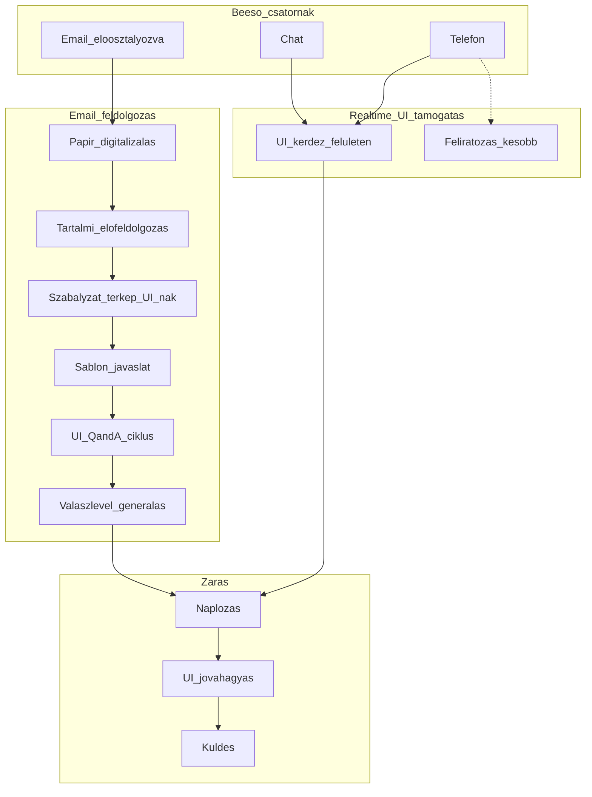

# ÁSZF és szerződési feltételek Q&A Agent — üzleti specifikáció (1. kör)

> Belső ügyintézői copilot B2C panaszokhoz. Üzleti és igény-specifikációs összefoglaló a végleges specifikáció és a technikai kör előtt.
> Dátum: 2026-06-06

---

## 1. Mit építünk

Belső **ügyintézői copilot** B2C panaszokhoz: a hatályos ÁSZF-re, szerződéssablonokra és kapcsolódó szabályzatokra hivatkozva segít a releváns rendelkezések azonosításában, válasz-előkészítésben és sablon-javaslatban — forráshivatkozással, a jogi tanácsadást nem helyettesítve.

**Pozicionálás:**

> *„Belső ügyintézői copilot B2C panaszokhoz: a hatályos ÁSZF-re, szerződéssablonokra és kapcsolódó szabályzatokra hivatkozva segít a releváns rendelkezések azonosításában, válasz-előkészítésben és sablon-javaslatban. Az agent sosem kommunikál közvetlenül az ügyféllel — telefonon és chaten kizárólag az ügyintézőt segíti, minden kimenő ügyfél-tartalmat embernek kell jóváhagynia. Nem helyettesíti a jogi tanácsadást.”*

---

## 2. Rögzített döntések

| Téma | Döntés |
|------|--------|
| **Kimenet autoritása** | Belső tájékoztatás + javaslat; kimenő levél kötelező ÜI szerkesztés + explicit jóváhagyás |
| **Dokumentum-hatókör** | Hatályos ÁSZF + kapcsolódó szabályzatok és szerződéssablonok / általános szerződési feltételek — nem egyedi szerződés |
| **PoC csatornák** | Mindhárom: email, chat, telefon (eltérő érettséggel) |
| **Jóváhagyás** | v1: egyszintű (ÜI); többszintű (supervisor/jogi) betervezve, későbbi fázis |
| **Adatok** | Valós, anonimizált ÁSZF + panasz-email készlet |

### Alapelvek (megerősített, nem felülbírálható)

1. **Human-in-the-loop minden ügyfél-irányú interakciónál** — az agent semmilyen csatornán nem kommunikál közvetlenül az ügyféllel. Minden kimenő tartalmat embernek kell engedélyeznie kiküldés előtt.
2. **Telefon és chat = kizárólag ÜI-segítségnyújtás (copilot)** — az agent az ügyintézőnek ad háttér-információt, forráshivatkozást és javaslatot; az ügyfél felé az ÜI kommunikál.
3. **Javaslat-orientált működés** — ahol a folyamat egyértelmű, az agent konkrét javaslatot ad. Ahol a szabály nem meghatározható előre, azt a betanulási / paraméterezési fázisban, a feltöltött dokumentumok alapján javasolja az agent (ÜI/jogi hagyja jóvá). A fennmaradó, dokumentumból sem levezethető kérdéseket a végén tisztázzuk.

---

## 3. Folyamat áttekintés (üzleti szint)

---

## 4. Azonosított kockázatos / nem determinisztikus pontok

### Kritikus
- Scope: Q&A agent vs. teljes panasz-orchestráció (validáció, jogi/reputációs kockázat).
- Csatorna-érettség: telefon feliratozás nélkül = manuális copilot; email papír/OCR lassú.
- Dokumentum-hatókör: sablon vs. egyedi szerződés szürke zóna (félrevezető válasz veszélye).
- Belső szabályzat-térkép vs. ügyfél válasz: ÜI kihagyhatja a kötelező tájékoztatást.
- Előző agent osztályozása: rossz kategória → rossz szabályzat/sablon; nincs visszacsatolás.
- Hiányzó eszkalációs ág: mikor áll meg az agent.

### Magas
- Iteratív ÜI–agent ciklus: draft-verziókezelés, felelősség a végső szövegért.
- Sablonválasztás: rossz sablon = rossz hangnem/jogalap.
- Előzmények (n2h): korábbi ígéretek, GDPR.
- Többcsatornás ugyanaz az ügy: dedup, ügy-azonosító.
- Papír út: OCR-hibák, postázás.
- B2C panasz-határidők: SLA figyelmeztetés hiánya.

### Közepes (governance, mérés)
- Zárási naplózás rendszerhatára (ticketing/CRM/irattár).
- KPI mérhetőség csatornánként.
- Hangnem / PII kezelés.
- Dokumentum-verziókezelés (elavult ÁSZF-re hivatkozás).

---

## 5. Nem determinisztikus pontok — javaslatok + döntés forrása

A „Forrás” oszlop: **Fix policy** (alapelvből egyértelmű) / **Dok-paraméterezés** (a feltöltött dokumentumokból a betanulási fázisban javasolja az agent, ember hagyja jóvá) / **Tisztázandó** (dokumentumból sem levezethető, a végén döntjük el).

| # | Pont | Javaslat | Forrás |
|---|------|----------|--------|
| 1 | Emelési triggerlista | Kötelező emelés: egyedi szerződésre utaló kérdés, vitatott összeg, ismétlődő panasz, fogyasztóvédelmi határidő közeleg, jogi/hatósági/média fenyegetés, alacsony konfidencia. | Dok-paraméterezés + Tisztázandó (konfidencia-küszöb) |
| 2 | Kimenő levél jóváhagyási workflow | Minden kimenőt ember hagy jóvá. v1: egyszintű ÜI. Többszintű (supervisor/jogi) betervezve, későbbi fázis. | Fix policy (PoC: egyszintű) + Roadmap |
| 3 | Kötelező behivatkozás panasztípusonként | Agent javasol behivatkozást és figyelmeztet, ha kihagyják; a listát szabályzatokból állítja össze. | Dok-paraméterezés |
| 4 | Osztályozás felülbírálás | ÜI bármikor felülírhatja; bizonytalanságnál agent több kategóriát + forrást javasol. | Fix policy |
| 5 | Egyedi szerződés határ | Egyedi előfizetésre utaló jel → „egyedi szerződést érinthet” + emelés; ÁSZF/sablon-válasznál mindig disclaimer. | Fix policy + Dok-paraméterezés |
| 6 | Sablonválasztás | Agent csak javasol (rangsorolva), nem választ automatikusan; ÜI dönt és szerkeszt. | Fix policy |
| 7 | Draft verzió | Minden iteráció naplózott verzió; explicit „Jóváhagyom kiküldésre” rögzíti a hivatalos szöveget. | Fix policy |
| 8 | Csatorna-prioritás | Ügy-azonosító alapú összevonás; vezető csatorna a jóváhagyott válaszé. | Tisztázandó (source of truth) |
| 9 | Disclaimer szöveg | Fix, jogilag jóváhagyott szöveg minden kimenő tartalmon; agent szövegjavaslatot ad. | Dok-paraméterezés + Tisztázandó (jogi jóváhagyás) |
| 10 | Dokumentum-frissítés | Verziószám + hatályba lépés dátuma; frissítéskor újra-paraméterezés. | Tisztázandó (governance) |

### Betanulási / paraméterezési fázis

A „Dok-paraméterezés” pontoknál az agent a feltöltött dokumentumokból javaslatot generál (emelési triggerek, kötelező behivatkozás, disclaimer-szöveg, egyedi-szerződés jelző fogalmak), amelyet az ÜI/jogi hagy jóvá. Így a determinisztikusan előre nem rögzíthető szabályok is dokumentum-alapú, auditálható javaslatként állnak elő.

---

## 6. PoC üzleti hatókör

**Benne:**
- Valós, anonimizált dokumentumkészlet: aktuális ÁSZF + panaszkezelési szabályzat + 1–2 szerződéssablon, valós anonimizált panasz-email készlet a validációhoz.
- Chat + telefon copilot (manuális bevitel), kizárólag ÜI-segítségként.
- Email (elektronikus): szabályzat-térkép (belső) + sablon-javaslat + iteratív Q&A.
- Forráshivatkozás minden válasznál.
- Emelési szabály bizonytalan / egyedi szerződés esetén.
- Egyszintű ÜI jóváhagyás minden kimenő ügyfél-tartalomnál (többszintű betervezve).
- Alap audit: kérdés–válasz–forrás napló.

**Üzletileg később / szimulált PoC-ben:**
- Papír digitalizálás + OCR.
- Feliratozás-alapú telefon.
- rsz. szolgáltatás-azonosító + előzmény (n2h).
- Automatikus email/posta kiküldés.

---

## 7. KPI-k

### Elsődleges (PoC)

| KPI | Mit mér | Cél |
|-----|---------|-----|
| Answer accuracy | Jogi/support validátor (1–5) | Átlag ≥4.0 |
| Source citation rate | Van-e forráshivatkozás | ≥95% |
| Hallucination / critical error | Hamis szerződéses állítás | 0% kritikus |
| Coverage | Kérdésbankra használható válasz | ≥80% |
| Time-to-answer | Kérdés → válasz | <30 mp |
| Escalation appropriateness | Helyes emelés bizonytalannál | ≥90% |

### Másodlagos / üzleti hatás (pilot után)
- Ticket deflection, handle time reduction, first contact resolution, agent adoption, CSAT, knowledge freshness lag.

### Kockázat-KPI (compliance)
- Out-of-scope answer rate (minimális), version mismatch (0), audit completeness (100%).

---

## 8. Nyitott kérdések (tisztázandó)

- **A. Szervezeti kontextus:** iparág/szolgáltatás (telekom, energia, e-ker, bank, SaaS); meglévő FAQ/wiki/sablon-katalógus.
- **B. Governance:** tudásbázis tulajdonosa (jogi/compliance); ÁSZF-frissítés gyakorisága/SLA; ki hagyja jóvá élesítés előtt.
- **C. Elfogadási küszöb:** pl. ≥80% gold standard; hackathon/fix határidő.
- **E. Integrációs határok:** előosztályozó agent kimenete (kategória, confidence, szolgáltatás-azonosító); source-of-truth rendszer (ticketing/rsz./irattár).

---

## 9. Következő feladatok

### Üzleti kör lezárása
1. Válasz a maradék A–C, E nyitott kérdésekre (vagy: az agent javasolja dokumentum alapján).
2. Végleges, kitöltött specifikáció a sablon 4 szekciójára (Leírás, Problémafelvetés, PoC megközelítés, KPI-k).

### Compliance kör
3. Jogi/fogyasztóvédelmi határidők beépítése (panaszkezelési válaszadási SLA → ÜI figyelmeztetés).
4. GDPR / adatkezelés: PII a panasz-emailekben és levélgenerálásban — adatminimalizálás, naplózási retention, anonimizálás.
5. Disclaimer és kötelező behivatkozás jogi jóváhagyása.
6. Audit / visszakövethetőség: kérdés–válasz–forrás–jóváhagyó naplózás (cél 100%), megőrzési idő.
7. Hallucináció- és out-of-scope kontroll: kritikus hamis állítás = 0; egyedi szerződésre „biztos” válasz tiltása.
8. Felelősségi mátrix: agent javaslat, ÜI jóváhagyott szöveg, téves osztályozás.

### Technikai kör
9. Adatforrások és formátumok: betöltés, verziókezelés, frissítési mechanizmus.
10. RAG-pipeline: chunkolás (paragrafus/§ szintű), embedding (magyar jogi szöveg), vektoradatbázis, retrieval + citation.
11. Modellválasztás: magyar nyelvi minőség, on-prem vs. felhő (adatvédelem).
12. Integráció: előosztályozó agent, ticketing/CRM/rsz., email-rendszer.
13. UX/felület: ÜI copilot (chat/telefon), email-flow, draft-verziókezelés, jóváhagyási lépés.
14. Mérés/KPI-eszköz: precision@k, válaszidő, gold standard kiértékelés, audit-teljesség.
15. Biztonság: hozzáférés-kezelés, PII-kezelés, naplózás, prompt-injection védelem a beérkező leveleknél.
