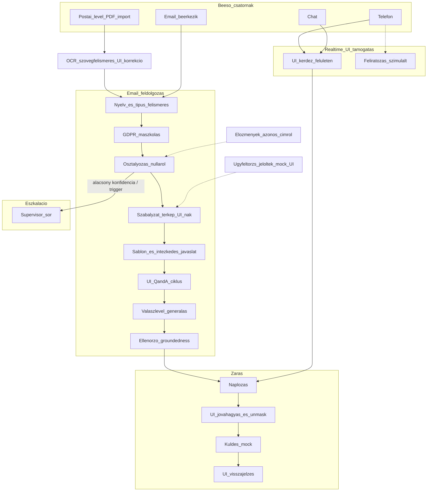

# ÁSZF és szerződési feltételek Q&A Agent — üzleti specifikáció (1. kör)

> Belső ügyintézői copilot B2C panaszokhoz. Üzleti és igény-specifikációs összefoglaló a végleges specifikáció és a technikai kör előtt.
> Dátum: 2026-06-06

---

## 1. Mit építünk

Belső **ügyintézői copilot** B2C panaszokhoz: a hatályos ÁSZF-re, szerződéssablonokra és kapcsolódó szabályzatokra hivatkozva segít a releváns rendelkezések azonosításában, válasz-előkészítésben és sablon-javaslatban — forráshivatkozással, a jogi tanácsadást nem helyettesítve.

**Pozicionálás:**

> *„Belső ügyintézői copilot B2C panaszokhoz: a hatályos ÁSZF-re, szerződéssablonokra és kapcsolódó szabályzatokra hivatkozva segít a releváns rendelkezések azonosításában, válasz-előkészítésben és sablon-javaslatban. Az agent sosem kommunikál közvetlenül az ügyféllel — telefonon és chaten kizárólag az ügyintézőt segíti, minden kimenő ügyfél-tartalmat embernek kell jóváhagynia. Nem helyettesíti a jogi tanácsadást.”*

---

## 2. Rögzített döntések

| Téma | Döntés | Miért ezt választottuk |
|------|--------|------------------------|
| **Kimenet autoritása** | Belső tájékoztatás + javaslat; kimenő levél kötelező ÜI szerkesztés + explicit jóváhagyás | A tartalmi felelősség a szervezeté (Fgytv./AI Act); az emberi jóváhagyás kizárja a felügyelet nélküli ügyfél-kommunikációt. |
| **Dokumentum-hatókör** | Hatályos ÁSZF + kapcsolódó szabályzatok és szerződéssablonok — nem egyedi szerződés | Az általános feltételek megbízhatóan kereshetők; az egyedi szerződés félrevezető választ adhatna, ezért kizárjuk és eszkalálunk. |
| **PoC csatornák** | Email, chat, telefon, **postai levél** (PDF-import + OCR) — eltérő érettséggel | A teljes ügyfélszolgálati valóságot lefedi; az email a legérettebb, a chat/telefon copilot-ként, a postai levél PDF-importtal + szövegfelismeréssel reálisan szimulálható. |
| **Jóváhagyás** | v1: egyszintű (ÜI); többszintű (supervisor/jogi) későbbi fázis | Az egyszintű elég az érték bizonyításához; a többszintű fölösleges komplexitás a POC-ban. |
| **Adatok** | Valós (letöltött) ÁSZF + generált, anonim panasz-email készlet | Valós dokumentum a hitelességhez; szintetikus, anonim email a GDPR és a hiányzó valós adatok miatt. |
| **Iparág / forrás** | Telekom — ONE (one.hu/aszf): ONE törzs, helyi kábeles, AH Média, Invitech + mellékletek + „Egyéb felhasználási feltételek" | Konkrét, nyilvánosan elérhető, gazdag és reális dokumentumkészlet; mind feldolgozva a teljes lefedettségért. |
| **Osztályozás** | Az agent nulláról osztályoz (önálló POC) | Nincs külső előosztályozó-függés → a POC önállóan demonstrálható; az integráció később szimulálható. |
| **Eszkaláció** | Eszkalált ügy supervisor-sorba kerül az appban | Valódi átadási folyamat demonstrálja a felelősség-átadást és a szerepköröket, nem csak jelzés. |
| **Konfidencia** | Konfigurálható küszöb, alatta automatikus eszkaláció | Átlátható, hangolható biztonsági háló a bizonytalan válaszok ellen (escalation-appropriateness KPI). |
| **Kimeneti módok** | (1) teljes AI-automata → kötelező disclaimer; (2) human-in-the-loop alapeset → disclaimer opcionális; kiküldés mock | Bemutatja az automatizálás és a kontrollált működés közti kompromisszumot; a disclaimer az automata módban az átláthatóságot (AI Act) biztosítja. |

> A technikai megvalósítás és a teljes tech-stack: lásd [ASZF_QnA_Agent_megvalositasi_terv.md](ASZF_QnA_Agent_megvalositasi_terv.md).

### Alapelvek (megerősített, nem felülbírálható)

1. **Human-in-the-loop minden ügyfél-irányú interakciónál** — az agent semmilyen csatornán nem kommunikál közvetlenül az ügyféllel. Minden kimenő tartalmat embernek kell engedélyeznie kiküldés előtt.
2. **Telefon és chat = kizárólag ÜI-segítségnyújtás (copilot)** — az agent az ügyintézőnek ad háttér-információt, forráshivatkozást és javaslatot; az ügyfél felé az ÜI kommunikál.
3. **Javaslat-orientált működés** — ahol a folyamat egyértelmű, az agent konkrét javaslatot ad. Ahol a szabály nem meghatározható előre, azt a betanulási / paraméterezési fázisban, a feltöltött dokumentumok alapján javasolja az agent (ÜI/jogi hagyja jóvá). A fennmaradó, dokumentumból sem levezethető kérdéseket a végén tisztázzuk.

---

## 3. Folyamat áttekintés (üzleti szint)

> A folyamat üzleti szintű; a részletes, lépésenkénti agent-gráf (node-ok, eszközhívások, állapot): lásd [ASZF_QnA_Agent_megvalositasi_terv.md](ASZF_QnA_Agent_megvalositasi_terv.md) Fázis 3.

---

## 4. Azonosított kockázatos / nem determinisztikus pontok

### Kritikus
- Scope: Q&A agent vs. teljes panasz-orchestráció (validáció, jogi/reputációs kockázat).
- Csatorna-érettség: telefon feliratozás nélkül = manuális copilot; postai/OCR feldolgozás lassabb és hibázhat.
- Dokumentum-hatókör: sablon vs. egyedi szerződés szürke zóna (félrevezető válasz veszélye).
- Belső szabályzat-térkép vs. ügyfél válasz: ÜI kihagyhatja a kötelező tájékoztatást.
- Saját (nulláról) osztályozás: rossz kategória → rossz szabályzat/sablon; ÜI-visszajelzés csatolja vissza.
- Hiányzó eszkalációs ág: mikor áll meg az agent.

### Magas
- Iteratív ÜI–agent ciklus: draft-verziókezelés, felelősség a végső szövegért.
- Sablonválasztás: rossz sablon = rossz hangnem/jogalap.
- Előzmények (n2h): korábbi ígéretek, GDPR.
- Többcsatornás ugyanaz az ügy: dedup, ügy-azonosító.
- Papír út: OCR-hibák, postázás.
- B2C panasz-határidők: SLA figyelmeztetés hiánya.

### Közepes (governance, mérés)
- Zárási naplózás rendszerhatára (ticketing/CRM/irattár).
- KPI mérhetőség csatornánként.
- Hangnem / PII kezelés.
- Dokumentum-verziókezelés (elavult ÁSZF-re hivatkozás).

---

## 5. Nem determinisztikus pontok — javaslatok + döntés forrása

A „Forrás” oszlop: **Fix policy** (alapelvből egyértelmű) / **Dok-paraméterezés** (a feltöltött dokumentumokból a betanulási fázisban javasolja az agent, ember hagyja jóvá) / **Tisztázandó** (dokumentumból sem levezethető, a végén döntjük el).

| # | Pont | Javaslat | Forrás |
|---|------|----------|--------|
| 1 | Eszkalációs triggerlista | Kötelező eszkaláció: egyedi szerződésre utaló kérdés, vitatott összeg, ismétlődő panasz, fogyasztóvédelmi határidő közeleg, jogi/hatósági/média fenyegetés, alacsony konfidencia. **Eldőlt:** konfigurálható konfidencia-küszöb, alatta automatikus eszkaláció. | Dok-paraméterezés + Fix policy (küszöb konfigból) |
| 2 | Kimenő levél jóváhagyási workflow | Minden kimenőt ember hagy jóvá. v1: egyszintű ÜI. Többszintű (supervisor/jogi) betervezve, későbbi fázis. | Fix policy (PoC: egyszintű) + Roadmap |
| 3 | Kötelező behivatkozás panasztípusonként | Agent javasol behivatkozást és figyelmeztet, ha kihagyják; a listát szabályzatokból állítja össze. | Dok-paraméterezés |
| 4 | Osztályozás felülbírálás | ÜI bármikor felülírhatja; bizonytalanságnál agent több kategóriát + forrást javasol. | Fix policy |
| 5 | Egyedi szerződés határ | Egyedi előfizetésre utaló jel → „egyedi szerződést érinthet” + eszkaláció; ÁSZF/sablon-válasznál mindig disclaimer. | Fix policy + Dok-paraméterezés |
| 6 | Sablonválasztás | Agent csak javasol (rangsorolva), nem választ automatikusan; ÜI dönt és szerkeszt. | Fix policy |
| 7 | Draft verzió | Minden iteráció naplózott verzió; explicit „Jóváhagyom kiküldésre” rögzíti a hivatalos szöveget. | Fix policy |
| 8 | Csatorna-prioritás | Ügy-azonosító alapú összevonás; vezető csatorna a jóváhagyott válaszé. **Eldőlt:** manuális összekapcsolás ügy-azonosítóval a POC-ban (auto-dedup később). | Fix policy (PoC: manuális) |
| 9 | Disclaimer szöveg | Fix, jogilag jóváhagyott szöveg; agent szövegjavaslatot ad. **Eldőlt:** jogilag óvatos draftot adunk, üzleti/jogi véglegesíti; teljes AI-automata módban kötelező, human-in-the-loop módban opcionális. | Dok-paraméterezés + Tisztázandó (jogi jóváhagyás) |
| 10 | Dokumentum-frissítés | Verziószám + hatályba lépés dátuma; frissítéskor újra-paraméterezés. | Tisztázandó (governance) |

### Betanulási / paraméterezési fázis

A „Dok-paraméterezés” pontoknál az agent a feltöltött dokumentumokból javaslatot generál (eszkalációs triggerek, kötelező behivatkozás, disclaimer-szöveg, egyedi-szerződés jelző fogalmak), amelyet az ÜI/jogi hagy jóvá. Így a determinisztikusan előre nem rögzíthető szabályok is dokumentum-alapú, auditálható javaslatként állnak elő.

---

## 6. PoC üzleti hatókör

**Benne:**
- **Dokumentumkészlet**: a ONE összes letöltött ÁSZF-je (ONE törzs, helyi kábeles, AH Média, Invitech) + mellékletek + „Egyéb felhasználási feltételek", §-szintű indexeléssel; `dok_tipus` megjelöléssel a hivatkozásnál.
- **Panasz-emailek**: ~10 generált magyar, anonim minta a fix taxonómia kategóriáira + legalább 1 nem-panasz és 1 idegen nyelvű példa; valós email beilleszthető/feltölthető.
- **Csatornák**: email (teljes flow) + chat/telefon copilot (manuális bevitel / beilleszthető átirat, feliratozás szimulált, kizárólag ÜI-segítségként) + **postai levél** (PDF-import a UI-on → OCR szövegfelismerés → innen ugyanaz a feldolgozás, mint az emailnél).
- **Postai levél flow**: PDF feltöltés a UI-on → **OCR** (szkennelt levél szövegfelismerése) → **ÜI-korrekciós előnézet** (az OCR-hibák javíthatók) → a felismert szöveg belép az email-flow-ba (nyelv-/típusfelismerés → maszkolás → …). *Miért:* a postai levél aszinkron, mint az email; a közös feldolgozás elkerüli a párhuzamos logikát, az OCR-előnézet pedig kezeli a szkennelési hibákat.
- **Email-flow**: nyelv-/típusfelismerés → GDPR-maszkolás → osztályozás (nulláról) → szabályzat-térkép → sablon- és intézkedés-javaslat → iteratív Q&A → válaszlevél → groundedness-ellenőrzés.
- **Előzmények (azonos email cím)**: az ügy nézetben listázódnak az adott címről korábban érkezett üzenetek (dátum, tárgy, kategória, státusz, kattintható), és **maszkolt előzmény-összegzés** belép az agent kontextusába. *Miért:* támogatja az „ismétlődő panasz" eszkalációs triggert és megakadályozza a korábbi ígéretekkel ütköző választ. (POC-scope: az inbox adataiból.)
- **Ügyféltörzs-jelöltek (email cím alapján, jövőbeli integráció)**: a UI-on dedikált panel listázza a címhez **tartozható ügyféltörzseket** (azonosító + név), **átlinkelési lehetőséggel**. *Miért:* az ÜI gyorsan azonosíthatja/megnyithatja a releváns ügyfelet; egy ügyfél kiválasztása a keresést a szolgáltatójára szűkítheti. POC-ban **mock** adat egy integrációs interfész mögött (valós ügyféladat-integráció későbbi fázis, RBAC + DPA mellett).
- **Forráshivatkozás** minden válasznál (§ + szó szerinti szöveg + `dok_tipus`), jogi szöveg mellett közérthető magyarázat.
- **Eszkaláció**: supervisor-sorba, konfigurálható konfidencia-küszöb alatt / triggerre (egyedi szerződés, vitatott összeg, SLA-lejárat stb.).
- **Intézkedés-javaslat** kockázat-szintezve (engedélyezett: önkiszolgáló/tájékoztatás, visszahívás/technikus).
- **Kimeneti módok**: (1) teljes AI-automata (kötelező disclaimer), (2) human-in-the-loop alapeset; kiküldés mock.
- **Szerepkörök**: ÜI + supervisor (eszkalált ügyek sora + összesített statisztika), konfig-userlistával.
- **Audit + Evaluation**: kérdés–válasz–forrás–jóváhagyó + modell/prompt/ÁSZF-verzió napló; referencia-mentes kiértékelő UI.
- **GDPR/biztonság**: visszafordítható PII-maszkolás, EU-rezidens felhős LLM (no-training), RBAC, napló-redakció.

**Üzletileg később / szimulált PoC-ben:**
- **Email-mellékletek** teljes OCR-feldolgozása (a postai levél OCR-je viszont POC-scope; az email-csatolmány továbbra is csak jelzés).
- Feliratozás-alapú telefon (most szimulált átirat).
- **Valós ügyféladat-integráció** (ügyféltörzs-lekérdezés email alapján): a POC-ban mock + UI-panel, az éles integráció (rsz. szolgáltatás-azonosító, n2h előzmény, automatikus dedup) későbbi fázis. *(Az azonos címről jövő email-előzmény figyelembevétele viszont POC-scope.)*
- Automatikus email/posta kiküldés; többszintű (supervisor/jogi) jóváhagyás; admin/„betanulási" UI.

---

## 7. KPI-k

### Elsődleges (PoC)

| KPI | Mit mér | Cél |
|-----|---------|-----|
| Answer accuracy | Jogi/support validátor (1–5) | Átlag ≥4.0 |
| Source citation rate | Van-e forráshivatkozás | ≥95% |
| Hallucination / critical error | Hamis szerződéses állítás | 0% kritikus |
| Coverage | Kérdésbankra használható válasz | ≥80% |
| Time-to-answer | Kérdés → válasz | <30 mp |
| Escalation appropriateness | Helyes eszkaláció bizonytalannál | ≥90% |

### Másodlagos / üzleti hatás (pilot után)
- Ticket deflection, handle time reduction, first contact resolution, agent adoption, CSAT, knowledge freshness lag.

### Kockázat-KPI (compliance)
- Out-of-scope answer rate (minimális), version mismatch (0), audit completeness (100%).

---

## 8. Nyitott kérdések (tisztázandó)

- **A. Szervezeti kontextus:** **Eldőlt:** iparág = telekom, forrás = ONE (one.hu/aszf). Meglévő FAQ/wiki/sablon-katalógus: nincs, válasz-sablonokat LLM-mel generálunk és emberi jóváhagyással validálunk.
- **B. Governance:** tudásbázis tulajdonosa (jogi/compliance); ÁSZF-frissítés gyakorisága/SLA; ki hagyja jóvá élesítés előtt. (Továbbra is tisztázandó az éles bevezetéshez.)
- **C. Elfogadási küszöb:** **Eldőlt:** nincs előzetes gold set; referencia-mentes (RAGAS-szerű) kiértékelés — groundedness, citation support, relevancy, retrieval-support — LLM-as-judge-dzsal.
- **E. Integrációs határok:** **Eldőlt:** a POC nulláról osztályoz (nincs külső előosztályozó-függés); source-of-truth = manuális ügy-azonosító, a vezető csatorna a jóváhagyott válaszé. Ticketing/CRM/rsz. integráció későbbi fázis.

### 8.1 Eldőlt funkcionális döntések (2. kör)

- **Nem-panasz email:** felismerés + rövid válaszjavaslat + „nem panasz" címke. *(Miért: a valós inbox vegyes; elkerüli a fölösleges panasz-feldolgozást.)*
- **Hatókörön kívüli / megválaszolhatatlan kérdés:** elutasítás + eszkaláció, nincs „biztos" állítás. *(Miért: hallucináció=0 KPI és AI Act tájékoztató-szerep.)*
- **Email-mellékletek:** POC-ban csak jelzés (OCR későbbi fázis). *(Miért: az OCR szimulált, nem kritikus a RAG-érték bizonyításához.)*
- **Szabályzat-térkép (ÜI nézet):** releváns §-ok + kötelező behivatkozások + alkalmazandó szabályzatok, forrással. *(Miért: ez a belső copilot lényegi értéke — gyors, forrásolt áttekintés.)*
- **Kötelező behivatkozás kihagyása:** agent figyelmeztet, de nem blokkol. *(Miért: alapelv, hogy az ÜI felel a végső szövegért; a blokkolás merev lenne.)*
- **Levél hangneme:** hivatalos, udvarias magyar, konfigurálható. *(Miért: elvárt ügyféllevél-regiszter, szervezeti stílushoz igazítható.)*
- **Dokumentum-verziókezelés:** egy aktuális verzió, verzió/dátum metaadattal. *(Miért: a POC az aktuális ÁSZF-re fókuszál; a több-verziós kezelés bonyolít, értéke későbbi.)*
- **GDPR:** automatikus, visszafordítható PII-maszkolás feldolgozás előtt; csak maszkolt szöveg megy (felhős) LLM-be. *(Miért: adatminimalizálás, miközben a valós név visszakerülhet a kiküldendő levélbe.)*

### 8.2 Eldőlt funkcionális döntések (3. kör)

- **Hatókör:** tájékoztatás + javasolt intézkedés, kockázat-szintezve (lásd 8.3). *(Miért: a konkrét következő lépés ad valódi értéket az ÜI-nak; a szintezés kezeli a jogi kitettséget.)*
- **ÜI-visszajelzés:** strukturált értékelés (jó/rossz, rossz forrás). *(Miért: gold set hiányában méri a minőséget és táplálja a finomítást.)*
- **Válaszlevél:** teljes, formázott email. *(Miért: a kiküldésre kész kimenet a végpontig-értéket demonstrálja.)*
- **Telefon/chat copilot:** beszédpontok + forráshivatkozás. *(Miért: az ÜI a saját szavaival kommunikál; a szó szerinti script merev lenne.)*
- **Jogi nyelv:** szó szerinti § + közérthető magyar magyarázat. *(Miért: gyorsítja az ÜI megértését, a § pontossága megmarad.)*
- **Ügy-státusz:** új → folyamatban → eszkalálva → jóváhagyásra vár → lezárva. *(Miért: átlátható, mérhető ügykezelés.)*
- **Prioritás:** agent javasol (sürgős/normál), inbox-rendezés. *(Miért: az SLA-veszélyes/súlyos ügyek előre kerülnek.)*
- **SLA:** figyelmeztetés + automatikus eszkaláció supervisorhoz lejáratkor. *(Miért: a fogyasztóvédelmi határidő elmulasztása jogi/reputációs kockázat.)*
- **Tudás-frissítés:** manuális újraindexelés + verzió/dátum. *(Miért: kontrollált és demózható; az automata letöltés WAF-érzékeny.)*
- **Idegen nyelvű email:** felismerés + jelzés, magyar válasz. *(Miért: a scope magyar; a felismerés megelőzi a téves feldolgozást.)*
- **ÜI szerkeszthet:** levélszöveg + forrás-hivatkozások. *(Miért: az ÜI felel a végső tartalomért, teljes kontroll kell.)*
- **Dokumentumtípus a hivatkozásnál:** ÁSZF / melléklet / „Egyéb felhasználási feltételek" megjelölve. *(Miért: eltérő jogi súly; a pontos hivatkozás és a félrevezetés elkerülése.)*
- **Postai levél csatorna:** PDF-import a UI-on → OCR szövegfelismerés → ÜI-korrekciós előnézet → belép az email-flow-ba. *(Miért: a postai panasz aszinkron, mint az email; a közös feldolgozás elkerüli a párhuzamos logikát, az OCR-előnézet kezeli a szkennelési hibákat. Megjegyzés: a postai OCR POC-scope, az email-csatolmány OCR nem.)*
- **Email-előzmények (azonos cím):** korábbi üzenetek listázása az ügy nézetben + maszkolt összegzés az agent kontextusába. *(Miért: ismétlődő panasz felismerése és korábbi ígéretekkel való konzisztencia; POC-scope az inbox adataiból.)*
- **Ügyféltörzs-jelöltek (email alapján):** UI-panel az azonosító + név listájával és átlinkeléssel; POC-ban mock egy integrációs interfész mögött. *(Miért: gyors ügyfél-azonosítás az ÜI-nak és keresés-szűkítés; a valós ügyféladat-integráció későbbi, RBAC + DPA mellett.)*

### 8.3 Intézkedés-javaslatok végrehajtása (eldőlt)

- **Kockázat-szintezett modell:** alacsony kockázatú intézkedés automatikusan végrehajtható (mock) a teljes AI-automata módban; közepes/magas kockázatú mindig emberi jóváhagyást igényel.
- **Engedélyezett intézkedés-típusok a POC-ban:** (a) önkiszolgáló-link / GYIK / tájékoztatás, (b) visszahívás / technikus időpont ajánlása. Jóváírás/kompenzáció és szerződésfelmondás NEM engedélyezett intézkedésként — ezeknél az agent eszkalál.
- **Audit:** minden javasolt és (mock) végrehajtott intézkedés naplózva (ki, mikor, mit, mely módban).
- A POC-ban valós CRM/számlázó hiányában a végrehajtás mock.

### 8.4 Compliance és adatbiztonság (eldőlt)

> *Miért így:* nagyvállalati telekom-környezetben a PII és az előfizetői adat kiemelt kockázat; a döntések az adatminimalizálást, az EU-rezidenciát és az auditálhatóságot helyezik előtérbe. A POC azokat a kontrollokat valósítja meg, amelyek a működést hitelesen demonstrálják, a többit tudatosan prod-roadmapre tesszük az arányosság jegyében.

**POC-ban megvalósítva:**
- **Felhős LLM EU adatrezidencia:** Azure OpenAI (EU) + DPA + no-training; csak maszkolt szöveg távozik. On-prem módban teljes egress-tiltás.
- **De-identifikációs térkép (token↔PII):** titkosított, elkülönített tár, hozzáférés-korlát, rövid megőrzés.
- **Prompt-injection védelem:** input-szanitálás + elhatárolás + instrukció-hierarchia + kimenet-/groundedness-validáció.
- **RBAC + PII-láthatóság:** maszkolatlan PII csak adott szerepkörnek, hozzáférés naplózva.
- **Napló-redakció:** logokban csak maszkolt szöveg.
- **GDPR Art. 22:** teljes-automata mód alacsony kockázatra korlátozva, emberi felülvizsgálat + átláthatósági tájékoztatás + naplózás.
- **DPIA + adatáramlási térkép:** könnyű DPIA POC-leszállítandóként.

**Tudatos POC-egyszerűsítés (prod-roadmap):**
- Titkosítás nyugalmi állapotban: POC = host lemeztitkosítás; prod = SQLCipher/kezelt tárak.
- Megőrzés/törlés: POC = politika dokumentálva; prod = auto-purge + érintetti törlés (Art. 17).
- Audit: POC = standard tábla; prod = append-only / hash-láncolt.
- Telekom Eht. (előfizetői/forgalmi adat): POC = standard PII-kezelés; prod = kiemelt kezelés.

**Governance:** titokkezelés (POC `.env`, prod vault); modell-/prompt-/ÁSZF-verzió rögzítése a válaszhoz; ÜI/supervisor feladatszétválasztás.

---

## 9. Következő feladatok

### Üzleti kör lezárása
1. Válasz a maradék A–C, E nyitott kérdésekre (vagy: az agent javasolja dokumentum alapján).
2. Végleges, kitöltött specifikáció a sablon 4 szekciójára (Leírás, Problémafelvetés, PoC megközelítés, KPI-k).

### Compliance kör
3. Jogi/fogyasztóvédelmi határidők beépítése (panaszkezelési válaszadási SLA → ÜI figyelmeztetés).
4. GDPR / adatkezelés: PII a panasz-emailekben és levélgenerálásban — adatminimalizálás, naplózási retention, anonimizálás.
5. Disclaimer és kötelező behivatkozás jogi jóváhagyása.
6. Audit / visszakövethetőség: kérdés–válasz–forrás–jóváhagyó naplózás (cél 100%), megőrzési idő.
7. Hallucináció- és out-of-scope kontroll: kritikus hamis állítás = 0; egyedi szerződésre „biztos” válasz tiltása.
8. Felelősségi mátrix: agent javaslat, ÜI jóváhagyott szöveg, téves osztályozás.

### Technikai kör
9. Adatforrások és formátumok: betöltés, verziókezelés, frissítési mechanizmus.
10. RAG-pipeline: chunkolás (paragrafus/§ szintű), embedding (magyar jogi szöveg), vektoradatbázis, retrieval + citation.
11. Modellválasztás: magyar nyelvi minőség, on-prem vs. felhő (adatvédelem).
12. Integráció: előosztályozó agent, ticketing/CRM/rsz., email-rendszer.
13. UX/felület: ÜI copilot (chat/telefon), email-flow, draft-verziókezelés, jóváhagyási lépés.
14. Mérés/KPI-eszköz: precision@k, válaszidő, gold standard kiértékelés, audit-teljesség.
15. Biztonság: hozzáférés-kezelés, PII-kezelés, naplózás, prompt-injection védelem a beérkező leveleknél.
