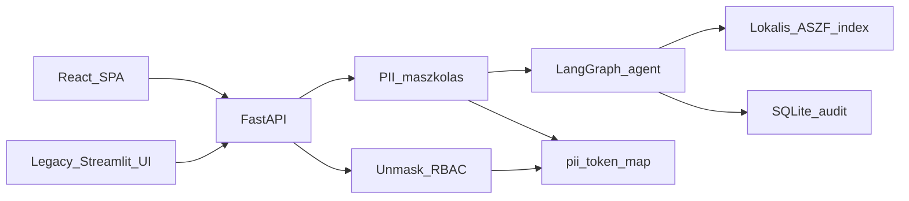

# ÁSZF Q&A Agent — DPIA és adatáramlási térkép (POC)

> Verzió: 2026-06-07 · Scope: belső ügyintézői copilot POC

## 1. Adatkezelés célja

- Belső ügyintézői döntéstámogatás ÁSZF-alapú forráshivatkozással.
- Nem közvetlen ügyfél-kommunikáció; kimenő tartalom csak emberi jóváhagyás után (mock küldés).

## 2. Adatkategóriák

| Kategória | Példa | Kezelés POC-ban |
|-----------|--------|-----------------|
| Bejövő üzenet | Email/levél szöveg | Maszkolás (`pii_token_map`), auditban csak maszkolt |
| Ügyfél-azonosítók | Email, telefon, ügyfélszám | Tokenizálás, unmask RBAC mögött |
| Agent kimenet | Draft, forrás-idézet | Maszkolt tárolás, verziózás |
| Audit | Döntési meta, eszkaláció ok | Redakció (`security/redaction.py`) |
| OCR (postai) | PDF szöveg | Maszkolt OCR + szerkeszthető előnézet |

## 2.b Adatosztályozási szintek (data classification)

| Szint | Leírás | Példa | Kezelési szabály |
|-------|--------|-------|------------------|
| **Publikus** | Nyilvánosan elérhető tartalom | ÁSZF PDF-ek, szabályzat-szövegek | Korlátozás nélkül indexelhető, LLM-promptba kerülhet |
| **Belső** | Üzleti, de nem személyes adat | Eszkalációs statisztikák, eval-riportok, kategória-címkék | Repo-ban tárolható, loggolható |
| **Személyes adat (PII)** | Azonosított/azonosítható természetes személy adata | Név, email, telefonszám, ügyfélszám | KIZÁRÓLAG maszkolva hagyhatja el a rendszert; maszkolatlanul csak a `pii_token_map`-ben él |
| **Maszkolt PII** | Tokenizált helyettesítő | `[NÉV_1]`, `[EMAIL_1]` | LLM-promptba, logba, auditba, tesztbe kerülhet; visszafejtés csak RBAC-védett `/unmask` úton |
| **Hitelesítési titok** | Kulcsok, jelszavak | `OPENAI_API_KEY`, jelszó-hash | Csak `.env`-ben (gitignore alatt); repo-ba, logba SOHA |

Érvényesítés: a maszkolás (`backend/masking.py`) a pipeline ELSŐ lépése, minden downstream
modul (classify, retrieve, draft, verify, escalation) kizárólag maszkolt szöveget kap.
Kapu-teszt: `tests/test_pii_gate.py`.

## 3. Adatáramlás

- Felhős LLM (prod cél): csak maszkolt szöveg egress.
- POC: determinisztikus agent fallback, opcionális felhő provider kapcsoló.

## 4. Jogalap és GDPR Art. 22

- Jogalap (prod döntésre vár): jogos érdek / szerződés teljesítése — POC dokumentációs szint.
- **Art. 22**: automata kimeneti módban (`output_mode=automata`) a rendszer `gdpr_art22_automated_decision` audit eseményt rögzít.
- Emberi felülbírálat: HITL alapértelmezett; kiküldés csak „Jóváhagyom kiküldésre” mock lépéssel.

## 5. Megőrzés és törlés

Konfig: `config/retention.yaml`

| Adat | POC megőrzés | Purge |
|------|--------------|-------|
| `audit_events` | 365 nap | `POST /governance/purge` (supervisor, dry_run alapból) |
| `pii_token_map` | 30 nap | ugyanott |
| Ügyek / draftok | 90 nap (dokumentált) | manuális prod folyamat |

Érintetti törlés POC-ban: `data_subject_erasure_contact` a retention konfigban; prod-ban case + token + audit purge workflow.

## 6. Biztonsági kontrollok (POC)

- RBAC: `security/rbac.py` - unmask, approve, audit, purge szerepkör szerint.
- Napló-redakció: audit payloadok PII-mentesítése tárolás előtt.
- Prompt-injection detektálás: `security/prompt_guard.py` a `/classify` ágon.
- Disclaimer: `config/disclaimer.yaml` - automata módban kötelező.

## 7. Tudatos prod-hiányok

- Titkosított de-id tár (POC: SQLite sima szöveg).
- Append-only / hash-láncolt audit.
- Azure OpenAI EU DPA és no-training szerződéses bekötés.
- Automatikus retention purge ütemezés.
